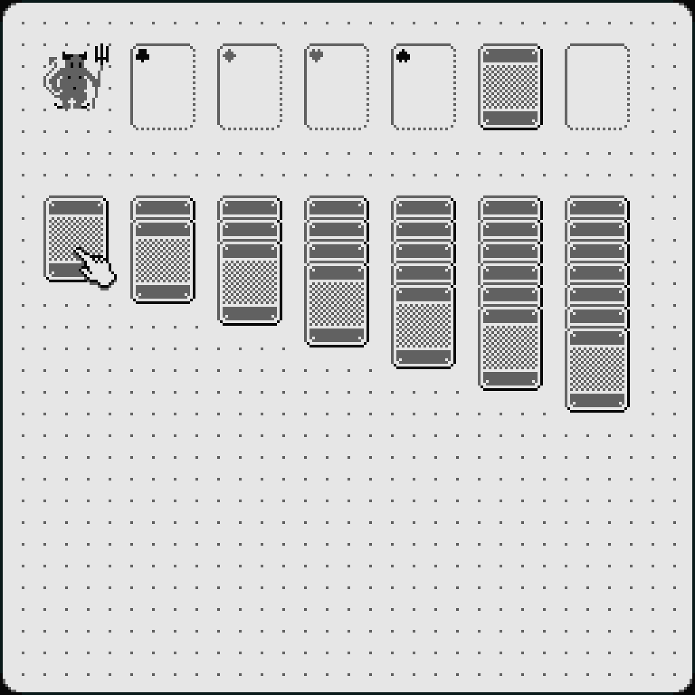

|                                                                                    |                                                                                                                                                                                                                               |
| ---------------------------------------------------------------------------------- | ----------------------------------------------------------------------------------------------------------------------------------------------------------------------------------------------------------------------------- |
|               | <h2> [Linear Text](https://lineartext.com)</h2>A graphical line-oriented plaintext editor. Each line of text is a card pinned to the board. Editing or moving a card edits or moves the line. Same plaintext, different view. |
|      | <h2> [Super Patience](https://superpatience.com)</h2>Pixelated solitaire. "Wildly frustrating."                                                                                                                               |
|                           | <h2> [void](https://github.com/oidoid/void)</h2>Tiny 2D game engine.                                                                                                                                                          |
|                                   | <h2> [mem](https://rndmem.com)</h2>Proportional and monospaced sans light pixel font family designed for large and small size readability, compactness, smoothness (pixel clustering), and visual consistency.                |
|                            | <h2> [01](https://oidoid.github.io/01)</h2>64 px² The Matrix themed WebGL shader.                                                                                                                                             |
|                          | <h2> [:play](https://github.com/reddit/play)</h2>A little playground for building apps on Reddit. [Many contributions since 2023](https://github.com/reddit/play/commits?author=niedzielski).                                 |
|  | <h2> [swankmania](https://github.com/niedzielski/swankmania)</h2>"Game Boy with vector graphics."                                                                                                                             |

## 

- [cb](https://github.com/niedzielski/cb) Universal command-line clipboard
  with automatic copy and paste detection. Eg, `cb|sort|cb`. The missing link
  between GUIs and CLIs!
- [git-diff-img](https://github.com/niedzielski/git-diff-img) A utility for
  differencing Git versioned images graphically.
- [makefile-skeleton](https://github.com/niedzielski/makefile-skeleton) A
  template for small makefiles.
- [whois-local](https://github.com/niedzielski/whois-local) Find a good
  available .com offline..
- [dotfiles](https://github.com/niedzielski/dotfiles) My Debian system
  configuration.
- [Marvin](https://gerrit.wikimedia.org/r/plugins/gitiles/marvin/+/refs/heads/master) A
  single page, isomorphic TypeScript Preact web app version of Wikipedia.
- [Wikipedia for Android](https://play.google.com/store/apps/details?id=org.wikipedia) Many
  [contributions from 2015-2017](https://github.com/wikimedia/apps-android-wikipedia/commits?author=niedzielski)
  to Wikipedia's native Android application. See also
  [Automated unit testing of Android Views across locale, accessibility, theme, screen and other configurations](https://www.youtube.com/watch?v=W_sf-kHAQkg&t=1040s),
  [Think twice, code once](https://diff.wikimedia.org/2017/12/06/think-twice-code-once/),
  and my work in the
  [Wikimedia Page Library](https://github.com/wikimedia/wikimedia-page-library/tree/6b62a1).
- [Desktop Improvements Project](https://mediawiki.org/wiki/Reading/Web/Desktop_Improvements) An
  overhaul of the Wikipedia user interface. I have mixed feelings about credits
  but nevertheless I've been proud to be mentioned for my small contributions on
  [Wikipedia's backpages](https://wikipedia.org/wiki/Special:Version).
- [Wikimedia Vue User Interface component library](https://github.com/wikimedia/wvui/tree/a6c699b) Technically,
  a fine Vue.js library for Wikipedia, MediaWiki, and beyond. Socially, an
  amazing journey for Wikimedia. A lot of the early work was guided by a
  [prototype](https://github.com/niedzielski/mw-components) I wrote.
- [Wikipedia Mobile](https://mediawiki.org/wiki/Skin:Minerva_Neue) The
  Wikipedia mobile site.
- [Page Previews](https://mediawiki.org/wiki/Page_Previews) Intelligent
  summary dialogs shown when hovering over Wikipedia article links.
  [Contributed 2018-20](https://github.com/wikimedia/mediawiki-extensions-Popups/commits?author=niedzielski).
  See also the
  [mustache.js to template literals migration](https://phabricator.wikimedia.org/phame/post/view/90/mustache.js_replaced_with_javascript_template_literals_in_extension_popups/).
- [practice](https://github.com/niedzielski/practice) Coding exercises and
  program sketches.
- [Cooking Recipes](https://github.com/niedzielski/cooking-recipes) My
  cookbook. How did you live without it? How will you live with it?
- [jscodeshift-recipes](https://github.com/niedzielski/jscodeshift-recipes) A
  collection of jscodeshift recipes.
- [atlas-pack](https://github.com/oidoid/atlas-pack) Aseprite sprite sheet
  parser, animator, and toolset for the browser and Deno.
- [shebang](https://github.com/niedzielski/shebang) A catalog of `#!` hacks.
- [nttt](https://github.com/oidoid/nttt) n² Tic-Tac-Toe (TypeScript).
- [MapQuest 2 for Android](https://web.archive.org/web/20150328135037/https://play.google.com/store/apps/details?id=com.mapquest.android.ace) MapQuest
  with vector maps. Many contributions between 2013-2015 got me a neat plaque.
- [Commute](https://web.archive.org/web/20150322212420/https://play.google.com/store/apps/details?id=com.mapquest.android.commute) 
  MapQuest's drive notification Android app (2014).
- [nature elsewhere](https://natureelsewhere.com/) An isometric adventure in
  an idealized state of nature (incomplete).
