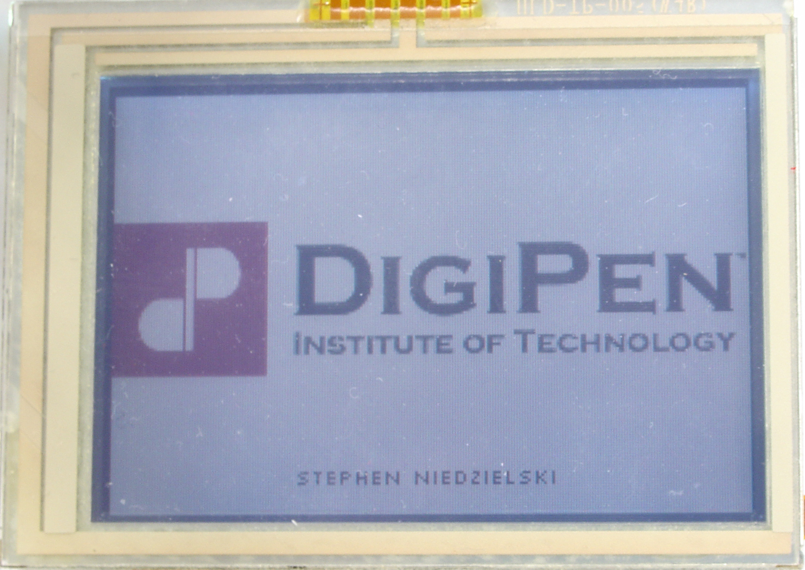
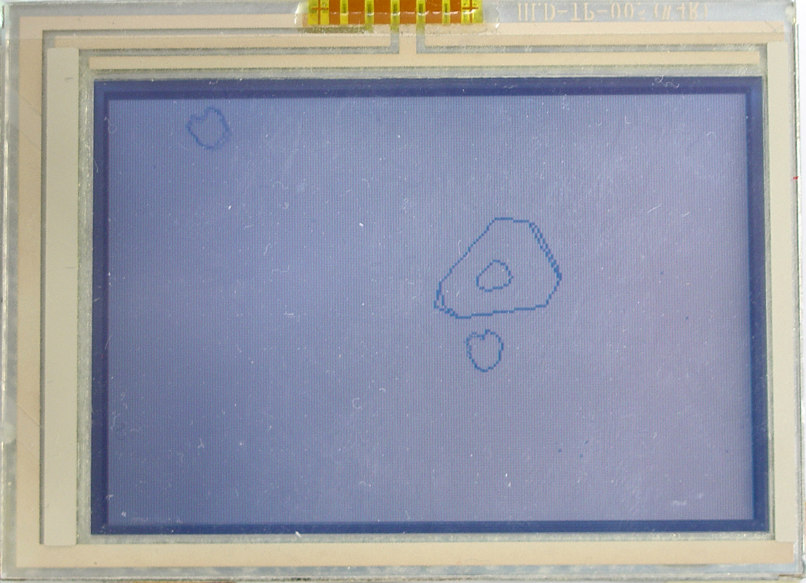
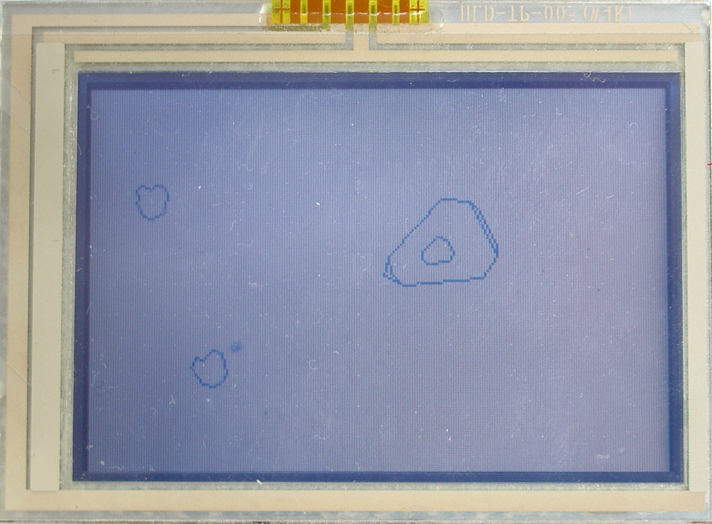
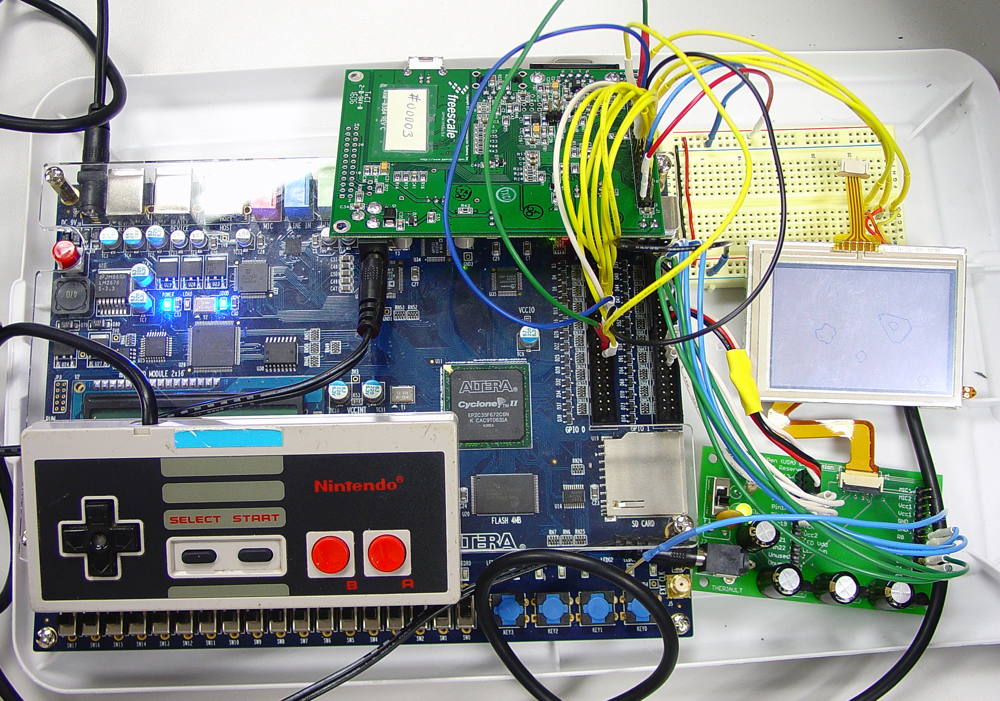

swankmania was a neat one semester project I did in the Fall of 2007. It was a
portable gaming device featuring a liquid crystal display (LCD), vector
graphics, and a vintage controller. As I needed to demonstrate the capabilities
of swankmania, I also designed BLiT, a small game in the vein of Asteroids.

The most interesting and challenging aspect of swankmania was designing the
vector graphics controller. This component is responsible for receiving model
vertices, color, mode, and other information and rasterizing their
representations on the LCD using a double buffered frame. As the throughput
needed to update the LCD many times a second was great, I developed the
mechanism on a field programmable gate array (FPGA) using synchronous and
asynchronous elements. Since there was only room for one frame on the FPGA, I
also interfaced with external RAM for the second frame. For line drawing, I
implemented a variation of the well known Bresenham algorithm in hardware.

Design on the FPGA incorporated multiple clock domains for the LCD controller,
rasterizer, and communications buffer. At completion, the device was capable of
updating every pixel on the 240 x 160 screen about 30 times over without missing
a frame at 72 frames per second.

BLiT was a very simple Asteroids-like game that demonstrated some of the neat
lossless aspects of vector graphics like scaling and rotation. I wrote BLiT
mostly in C on a microcontroller that interfaced with the vector graphics
controller and an old input controller from the Nintendo Entertainment System.

Special thanks goes to Christopher Theriault for designing the LCD printed
circuit board (PCB), Mike Anderson for rendering tips and miscellanies, Cesar
Carrasco for soldering components to the LCD PCB, and Todd Seiler for
miscellanies.

Here's some photos of the project:

_Addendum (2022-09-23): swankmania, the physical, one-of-a-kind hodgepodge was
stolen in transit from a college fair circa 2009. My computer containing all of
swankmania's software sources and related materials, as well as my up-to-then
life's work, was also stolen in a burglary in June, 2011 leaving nothing but
these short notes. However, Chris Clark, a dear classmate one year my junior,
saved some snapshot of swankmania I had given him and generously returned the
favor on December 8th, 2012.
[I've since shared these sources on GitHub](https://github.com/niedzielski/swankmania),
such as they are._
