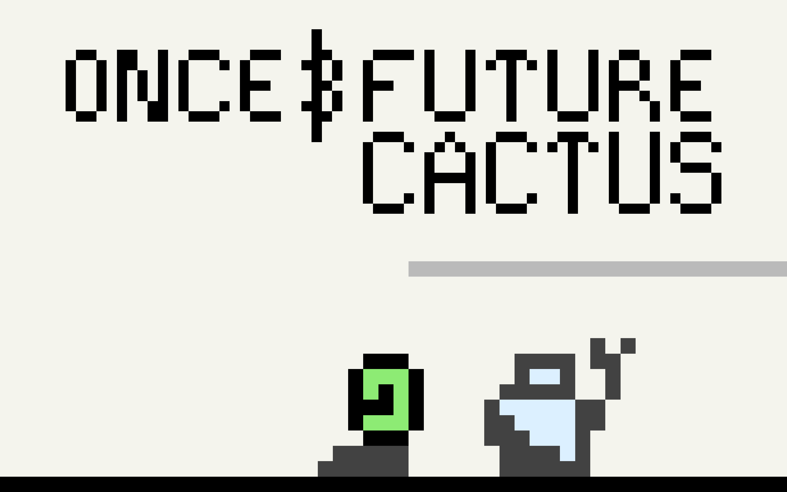

_This log was originally posted to the
[TIGSource Forums](https://forums.tigsource.com/index.php?topic=58848.msg1300107#msg1300107)._

Once and Future Cactus is super early in development. Not much to show yet but I
always wanted to be more involved in this community since discovering it a few
years back.

## Plot

You're Cactus, a human like wanderer resembling a large bar of green soap. As
you journey through a handful of settings, you encounter mostly enemies and a
few neutral lifeforms you're unable to communicate with. Your only solace and
incohesive explanation for the strange world you inhabit is in books and scraps
of epistolary information you come across.

## Gameplay

Tap or click to interact or move. There will definitely be a handgun and
hopefully a large inventory of items, including a detailed log of all
discoveries made.

## Graphics

The graphics are super low resolution. The avatar is currently 6px tall. A 4x4
fixed width pixel font is [in progress](https://github.com/rndmem/mem-font). The
game is scaled to window size as pixel perfect as the ecosystem allows.

## Audio

Lots of ideas but not started yet.

Check out the code on
[GitHub](https://github.com/rndmem/once-and-future-cactus).
