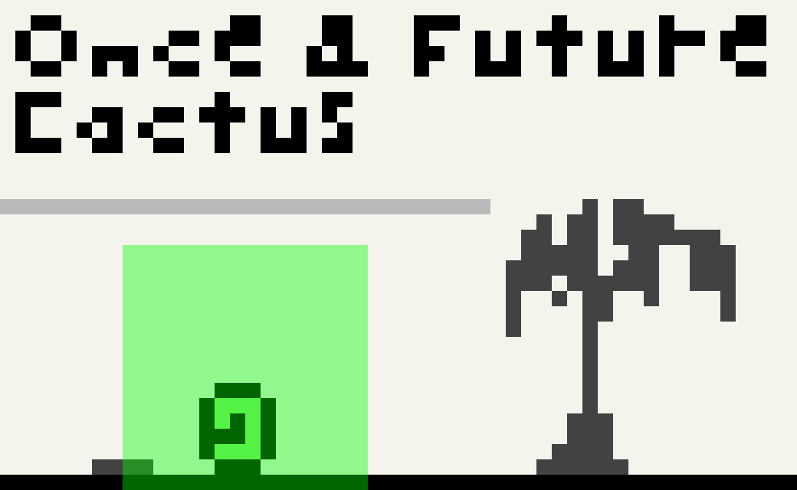

_This log was originally posted to the
[TIGSource Forums](https://forums.tigsource.com/index.php?topic=58848.msg1304474#msg1304474)._

I've been just appending to the original post which isn't how things are down
around here. Here's all the updates since this realization in one deuce below.
Future updates will appear as replies :]

Dec 6th 2016: I pushed some minor tweaks to the mem font and made some scripts
to automate the build. I need to get package.json sorted to actually deliver a
ttf file. I'm having trouble getting it show without antialiasing in the game so
I may need to add bitmap support somehow.

Dec 8th 2016: A couple fixes to the mem font so it actually gets published in
the NPM package. I think I've got that business sorted. Now to work on the
antialiasing issue.

Dec 12th 2016: I've been very busy with some upcoming work stuff but I sort of
learned how to use Python-Fu directly from GIMP's command line which is nice. I
was running TinyScheme scripts before which was fine but I would have used
Python if I had known. I updated my list of
[shebang hacks](https://github.com/niedzielski/shebang/blob/master/demo/gimp)
and converted the TinyScheme
[script](https://github.com/rndmem/mem-font/blob/master/bin/gimp-export-pngs).
This is all for that sweet mem font and I said "sort of learned" because I still
can't figure out how to convert the result pdb.gimp_image_list() from an INT32
ID to an IMAGE even though similar code worked in TinyScheme.

I still can't disable antialiasing when the font is in game (in GIMP it looks
crispy). I've tried all the Phaser and CSS antialiasing options I could find but
no dice. I even tried forcing canvas mode and shifting by a half pixel. Oh well.

I'm now trying a sprite sheet with a .fnt file but the font (4x4px) is actually
too small to use with the recommend tool at it's native size and still shows up
blurry regardless. I'm hoping this is the last pixel perfect / sizing issue I
have. I'm gonna write a .fnt file for the new sprite sheet and start testing
stock bitmaps if that doesn't work. o/

Dec 13th 2016: I forgot in my last post that I actually already have bitmaps
drawing just right (in a previous game prototype I was using vector graphics for
everything). So I went forward with making my own .fnt file. I just copied the
5px version from [Littera](http://kvazars.com/littera/) and found
[this doc](http://www.angelcode.com/products/bmfont/doc/file_format.html) on the
format which I used to flesh it out a little. It's XML-ish.

I wrote the first unique bits by hand and, with a few lines of Bash to generate
the character map, was able to hack together an output for testing quickly. I
got the casing wrong on one attribute but after I spotted that it pretty much
worked! It's super crisp. However, I've no idea about how fixed width and
kerning should play together. That part still looks like rubbish. I've manually
added kerning tweaks to a couple characters in the .fnt file and here's what
that looks like:

The kerning support in the .fnt file is really primitive. Where needed, kerning
specialization between every permutation of character pairs will need to be
identified and specified. The font is even less readable without kerning so I'm
pretty sure I need it but I don't know what this should look like when I'm
showing a countdown sequence, for example. I don't want the numbers bouncing
back and forth because of different kerning. Maybe just for numbers it's always
the same?

No real commits today. I gotta get all of this from complete hackjob to partial
hackjob. In particular, I really hope that if I need kerning I can encode all
this information into the FontForge file and still keep that process from GIMP
source to FontForge automated. The only other noteworthy mention is that I've
started versioning the devlog itself in the repo since I'm taking the trouble to
write it and it's all about the game.
