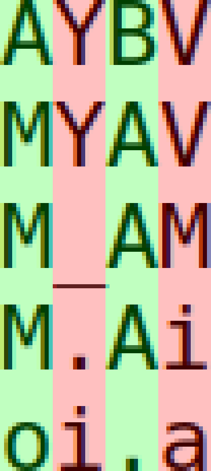
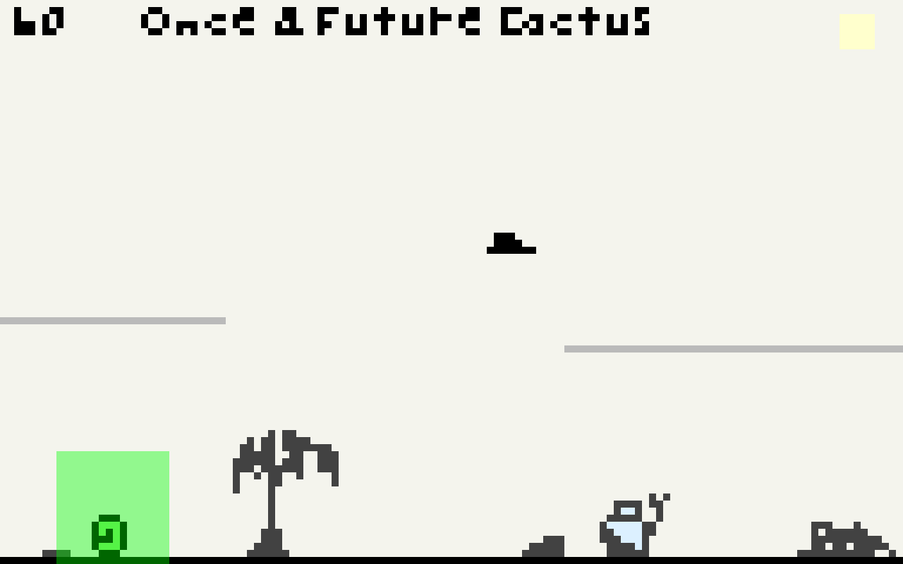

_This log was originally posted to the
[TIGSource Forums](https://forums.tigsource.com/index.php?topic=58848.msg1304479#msg1304479)._

I've been busy lately but have somehow done a ton of work too. mem font is
pretty much done!

According to [Wikipedia](https://en.wikipedia.org/wiki/Kerning#Kerning_values),
monospaced fonts do not use kerning. It seems legit. Here's a close up of a
screenshot I took in Sublime Text showing different characters all occupying the
same widths:

So I decided to split the font into monospaced and proportional fonts! There
will be many tweaks to the proportional font's kerning and probably some of the
shared glyphs of both but it's very functional for what I want.

With so low a resolution, text of any length takes up way more room than I had
hoped. I did mock out some screenshots previously but I was still thinking
optimistically that I would be able to keep the camera on the character tightly.
Since I'm planning on the player uncovering many short passages, I'll need the
room for text either via a dedicated inventory and reading screen with high
resolution, doubling the pixels drawn for everything but text, or increasing the
resolution everywhere.

Here's a shot of the new monospaced font for a FPS counter and some demo text in
the prop font at an increased resolution:

I think I'll next start trying to better integrate the Tiled map editor's output
functionality with the game. I also want to apply some of the build and
packaging learnings from the mem font into the game.
