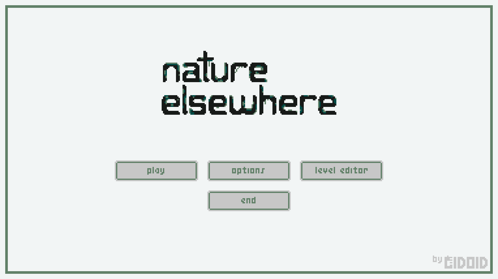
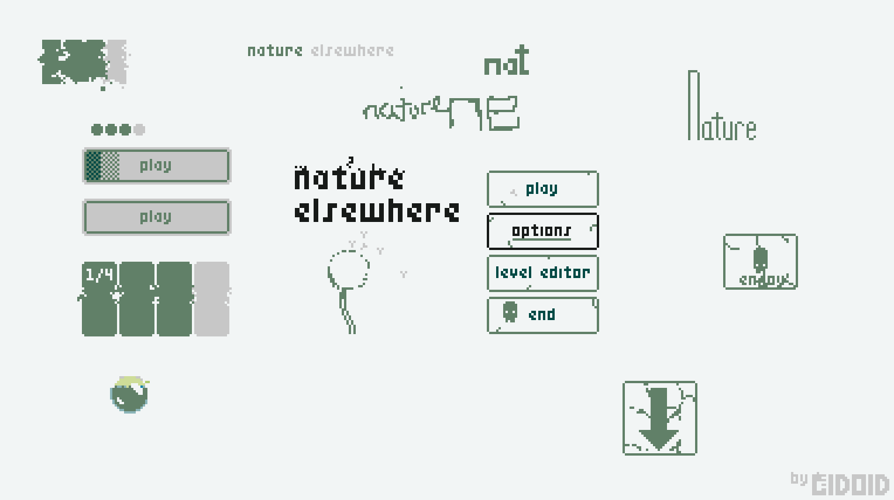
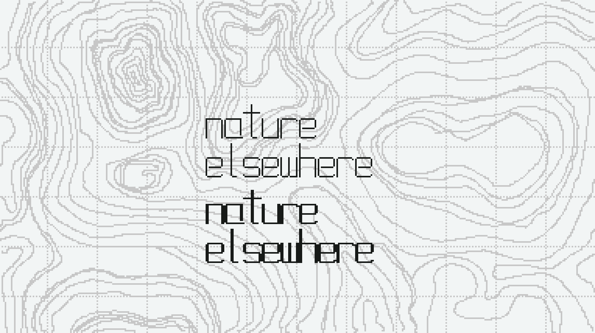
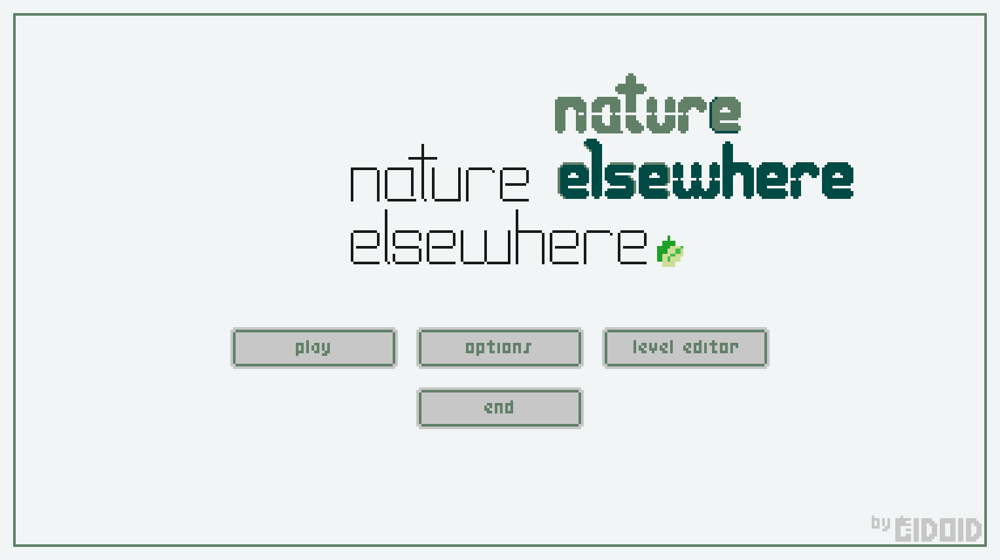
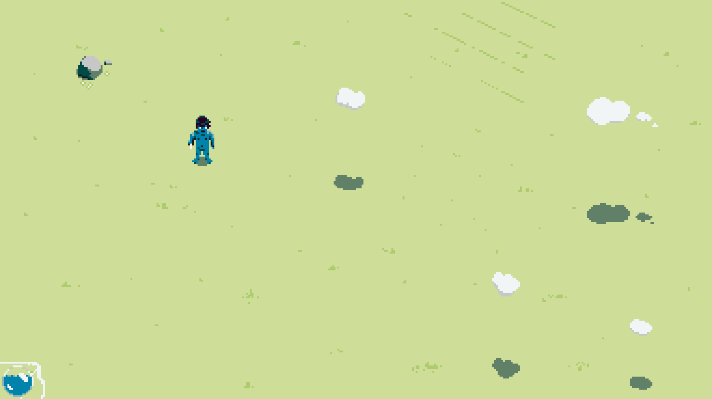
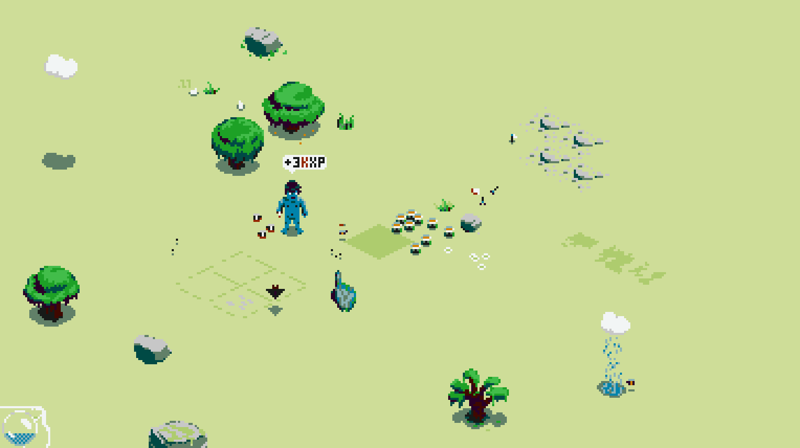
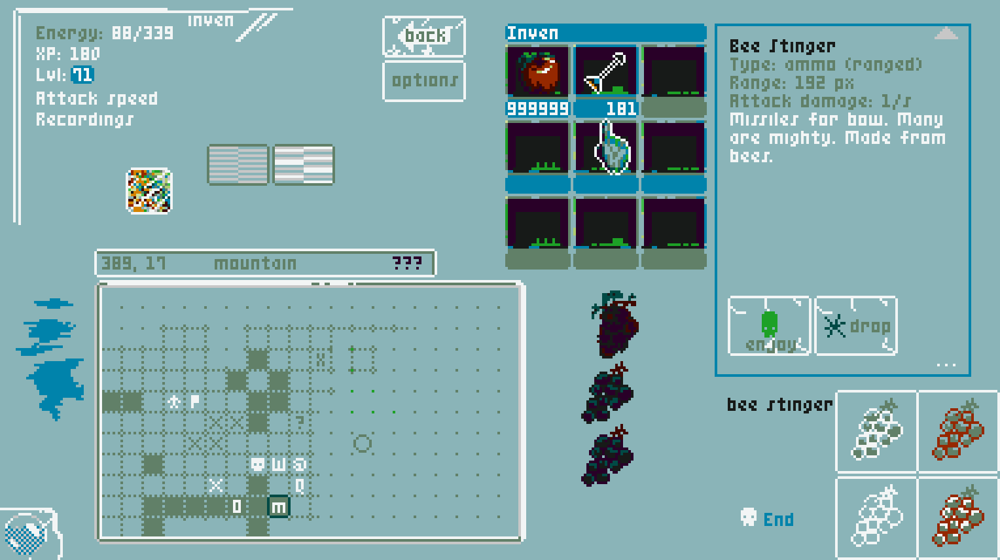
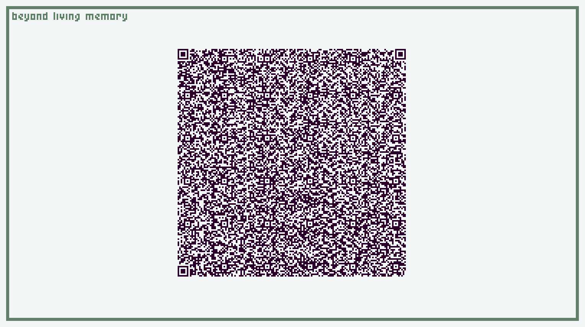

## Title

### Other Sketches

## Exploring the World of Nature Elsewhere and Action

 

## Inventory Sketch

Lots of UI sketching. I am currently targeting an LCD-like interface.

## Data Export

I feel there's a certain magic in barcodes, old barcode games, the :CueCat, and
QR codes. I hope I can bring some of that to life in Nature Elsewhere.
