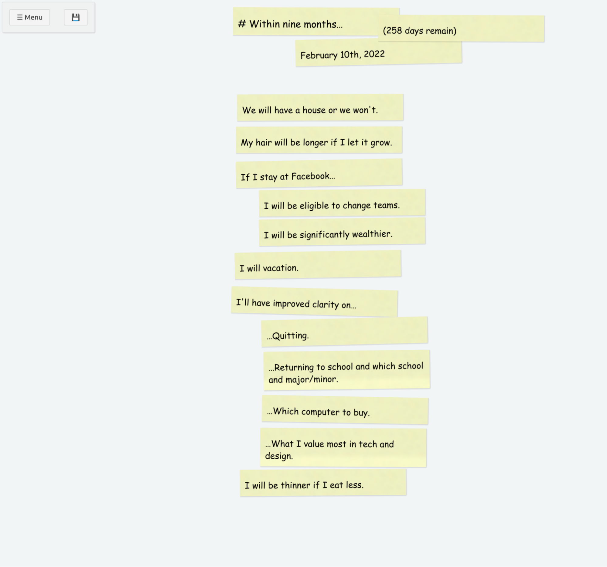
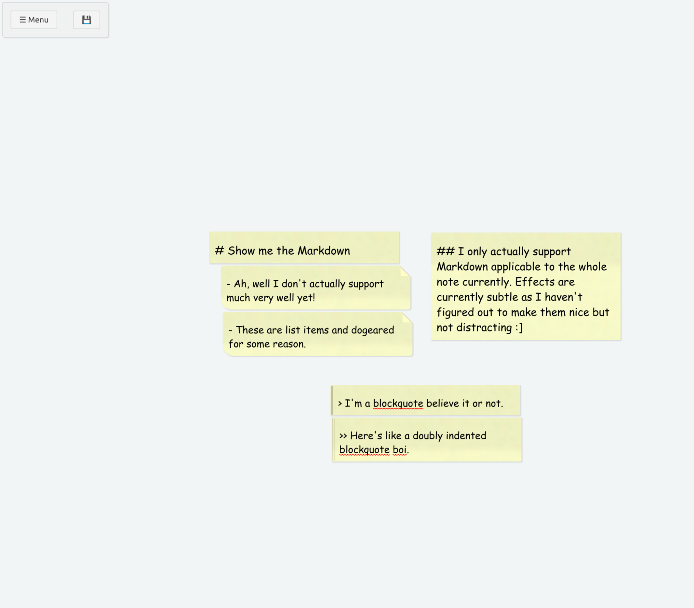
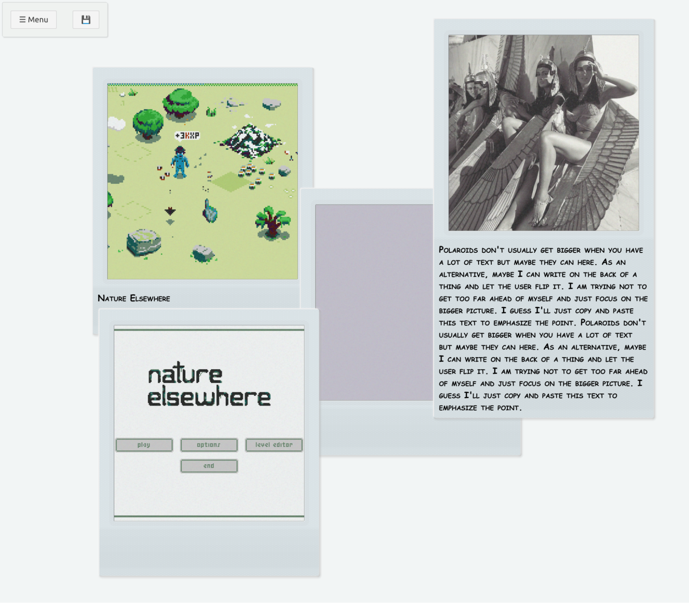

## Background

Notes have always been an important part of my life. I've taken copious notes
since I was 12, maybe longer. I think of notes as a kind of second brain or
living thing of its own. I lost all my data in a 2011 burglary and it really
felt like losing a big piece of my own mind that I haven't gotten over.

As a kid, I used a waterproof notebook and pen. They held up to the rigors of my
pocket well. I've made many changes since, have always been dissatisfied, and am
always looking for something better.

The latest apps are no different. I am totally enamored with how sexy they are
but pretty soon I am totally lost in the UI and my data is trapped in their
proprietary formats. I can export Trello to JSON, sure, but how do I make sense
of it?

I've been making due with Markdown for years and I like it well enough. I just
want something a little more list-centric and with a more pleasing UI that makes
me feel good.

I don't have a name for such a thing yet but I've been calling it "Perfect
Notes" for the time being.

## What is it?

I am still figuring that out. Here's what I think it is at the moment:

- The text is the UI and the UI is text. The two representations always
  correspond so use whichever you prefer whenever you prefer.
- The underlying data format is a CSV (actually, I use tab-delimited).
- If your CSV header includes Perfect Notes columns, they will be used. If not,
  sensible defaults will be used and the original data format won't be changed.
- Each row of the CSV is represented as a fragment in the UI. Fragments supports
  a few possible data sources including:
  - x and y: position.
  - thing: how to visually represent the fragment. Two types are supported
    currently: photo and note.
  - text: if the thing supports a text field, it will be used.
  - image: if the thing supports an image, it will be used.
- No newlines :]

I'm still uncovering interesting ways the pieces fit together. I want the UI to
correspond to text and vice-versa so, for example, cards that are close together
in the UI are grouped in the CSV. Similarly, the markdown feels a lot more
natural when the first column is text.

## What will I use it for?

- I want a nice way to keep lists.
- I want to track things that are important to me. For example, my favorite
  songs or favorite Nintendo games.
- I want to be able to organize my thoughts in a more visual way and be able to
  switch to plain text seamlessly and losslessly.
- I want my notes to feel real and special like a scrapbook or a personal
  journal without compromising on plain text or having to carry a physical
  object.
- I want a nice way to manage personal projects like my game.

## Examples

### 9 months



```
  text    thing    x    y    z    w    h    rotate    background    created    modified

  # Within nine months…    note    403    13   	 287    53    0.19   	 2021-05-10T16:08:35.641Z    2021-05-11T03:03:59.752Z
  February 10th, 2022    note    511    66   	 287    53    -1.29   	 2021-05-10T16:08:51.335Z    2021-05-10T23:47:09.138Z
  (258 days remain)    note    654    26   	 287    53    0.28   	 2021-05-11T03:03:08.420Z    2021-05-28T16:05Z

  We will have a house or we won't.    note    410    163   	 287    53    -0.18   	 2021-05-10T16:09:16.235Z    2021-05-11T02:58:04.787Z
  My hair will be longer if I let it grow.    note    408    219   	 287    53    -0.08   	 2021-05-10T16:09:52.626Z    2021-05-11T02:58:07.141Z
  If I stay at Facebook…    note    408    277   	 287    53    -1.15   	 2021-05-10T16:10:17.313Z    2021-05-11T02:58:09.652Z
  I will be eligible to change teams.    note    448    328   	 287    53    -0.44   	 2021-05-10T16:10:36.308Z    2021-05-11T02:58:13.052Z
  I will be significantly wealthier.    note    448    378   	 287    53    -0.79   	 2021-05-10T16:10:51.535Z    2021-05-11T02:58:15.636Z
  I will vacation.    note    406    435   	 287    53    -1   	 2021-05-10T16:11:17.534Z    2021-05-11T02:58:19.012Z

  I'll have improved clarity on…    note    400    499   	 287    53    1.48   	 2021-05-10T16:12:15.943Z    2021-05-11T02:58:20.892Z
  …Quitting.    note    452    551   	 287    53    -1.39   	 2021-05-10T16:17:15.965Z    2021-05-11T03:00:27.991Z
  …Returning to school and which school and major/minor.    note    456    607   	 287    74    -0.77   	 2021-05-11T02:58:41.386Z    2021-05-11T03:00:30.190Z
  …Which computer to buy.    note    453    686   	 287    53    1.05   	 2021-05-11T02:58:55.787Z    2021-05-11T03:00:33.574Z
  …What I value most in tech and design.    note    450    741   	 287    74    0.26   	 2021-05-10T16:18:08.025Z    2021-05-11T03:00:35.158Z
  I will be thinner if I eat less.    note    415    812   	 287    53    -0.43   	 2021-05-10T23:45:19.484Z    2021-05-11T03:00:38.142Z
```

### Markdown?



```
  text    thing    x    y    z    w    h    rotate    background    created    modified

  # Show me the Markdown    note    517.5    452.5   	 287    48   		 2021-06-03T05:15Z    2021-06-03T05:15Z
  - Ah, well I don't actually support much very well yet!    note    535    504   	 287    67   		 2021-06-03T05:15Z    2021-06-03T05:15Z
  - These are list items and dogeared for some reason.    note    538    574   	 287    67   		 2021-06-03T05:16Z    2021-06-03T05:16Z

  ## I only actually support Markdown applicable to the whole note currently. Effects are currently subtle as I haven't figured out to make them nice but not distracting :]    note    853    454   	 287    163   		 2021-06-03T05:16Z    2021-06-03T05:17Z

  > I'm a blockquote believe it or not.    note    701    685   	 287    46   		 2021-06-03T05:15Z    2021-06-03T05:15Z
  >> Here's like a doubly indented blockquote boi.    note    703    734   	 287    67   		 2021-06-03T05:15Z    2021-06-03T05:16Z
```

### Some photos



## Technology

I've been taking a no modesty approach to coding and just pounding out most
stuff. The current technology happens to be Svelte and TypeScript. Everything is
frontend currently. Trying to decide whether to use Google Drive API for most of
the backend or use Electron and stick to native. Firefox support sucks because
of lacking File API.

## Summary

It's been fun to think about and to think with. It's one of those bootstrapping
tools that you can use to help build itself which I think is extra fun.
