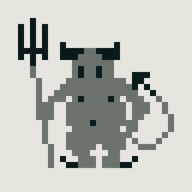

I've been working on a game of solitaire / patience / demon. My interest was
rekindled by an unexpected inquiry from a stranger about an incomplete
implementation,
[klondike-solitaire](https://github.com/oidoid/klondike-solitaire), I made last
year but it's something I had to hoped to complete since starting.

The game won't be anything special. The project goal is to be an approachable
effort to work my way back towards Nature Elsewhere, a much larger work with
many similar challenges. I've already seen some promising progress:

- I converted the old code over to Deno TypeScript. It's a marvelous ecosystem
  (I also use it for this site) and recent developments such as the task runner
  (like NPM scripts) have only made it nicer. I keep waiting for when I'll need
  some nasty glue, and I do think it's coming, but it hasn't yet. I'm even using
  Deno for bundling right now.
- I am exploring a monorepo style with Git submodules where the old code,
  klondike-solitaire, is generic card game logic and sawfish-solitaire is "the
  game." Most exciting to me is isolating some code I keep losing and keep
  rewriting into a shared library which I am looking forward to reusing
  elsewhere too.

Probably most of my time has been experimenting and bikeshedding on
implementation details, mostly for the fun of it. I have maybe 90% of the card
game logic complete and am currently reviving all the old code I can into the
shared library.

The working title is "Sawfish". The name is inspired by the submarine in these
haunting plot summaries for On the Beach
([novel](https://en.wikipedia.org/wiki/On_the_Beach_(novel)#Plot),
[1959 film](https://en.wikipedia.org/wiki/On_the_Beach_(1959_film)#Plot)). It
was fun to think on someone being the last person on Earth in this submarine of
the dying, playing their own game of patience. Name is tentative though, and I
don't think anyone will think more on it.

I've been reflecting on this
[interview with Gunpei Yokoi (Game Boy inventor) and Yukihito Morikawa](https://shmuplations.com/yokoi/)
(warning: interview objectifies women) more than I realized. The art style will
be very minimal like an LCD watch which I chose to keep the project small, it
looks neat, and because I don't want to try to compete with the player's
imagination.

I played a little Bloodstained: Ritual of the Night earlier this year (it's by
the guy known for Castlevania: Symphony of the Night, I think). I am being a bit
old-fashioned but I just didn't feel like they left much room for my
imagination. It was like everything they could do, they did, and somtimes that
was the only reason for it. An example is when the protagonist uses a gun, maybe
every three shots she has to yell, "take this!" It's literal noise. It feels
stifling like I can't put what I want there.

I think it's a big problem for indie games like mine because I don't have the
budget or ability to stretch the imagination with never-before-seen special
effects. It's more about what I don't put there than what I do. Anything I do
put there has to be intentional and well-executed within the constraints set or
it will just be a cheaper version of something else, instead of something
special for what it is.

The palette is three colors when flattened but four with transparency (2-bit).
Here's the title placeholder:

(And here's the favicon which I hastily hacked up into the title logo above:)

I think I want to have four variations of ~12-13 characters. I don't know if the
characters will have any continuity. Here's the current placeholders for the
queens which helped me find a size that I could draw people in as wanted:

I might have this entity in there too, Patience the Demon:

They don't do anything except observe your activity and record scoring and state
like Clippy, which I think might be fun. I should probably cut the blink
in-between.

If I stick with the sawfish theme, I might try to do a cross between the fish's
saw blade and the submarine across the four aces horizontally or maybe an
outline for the logo. I've also been thinking on including an
[S-O-S Morse code sequence sound](https://www.youtube.com/watch?v=y7eNohjaDbs),
maybe on "win".

The going is slow due to work and the responsibilities of being but I am happy
it is developing.
