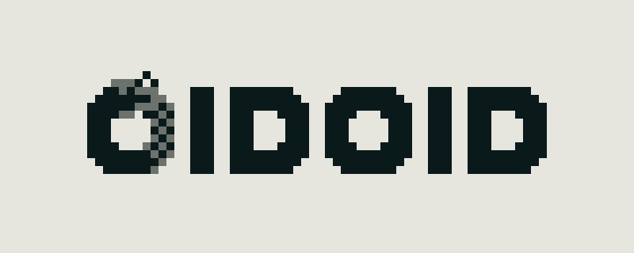
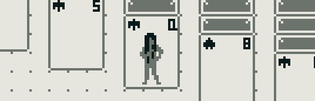
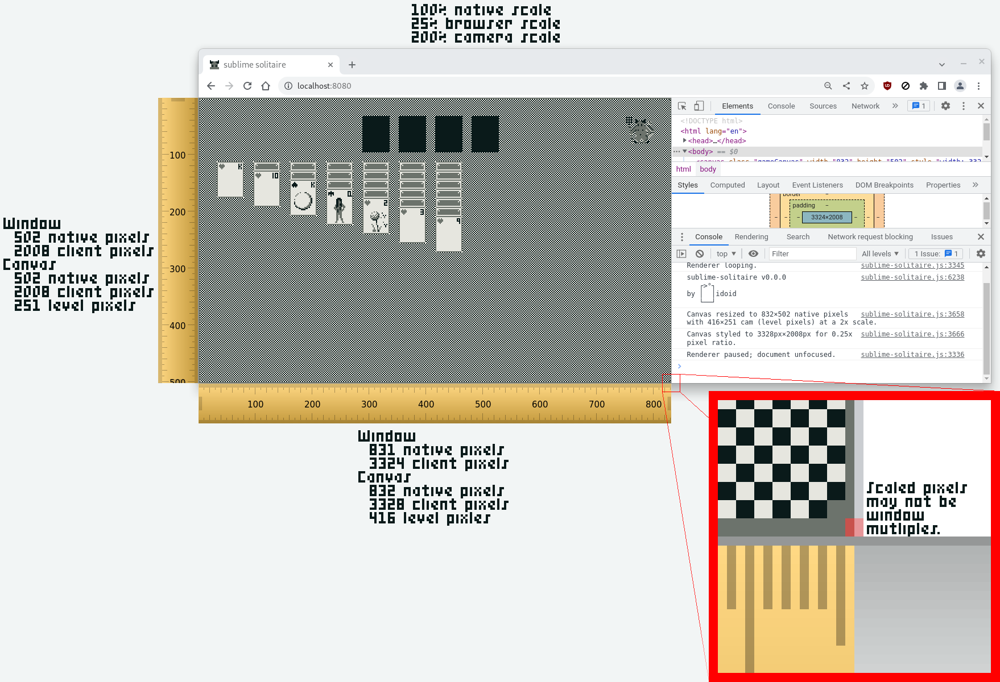
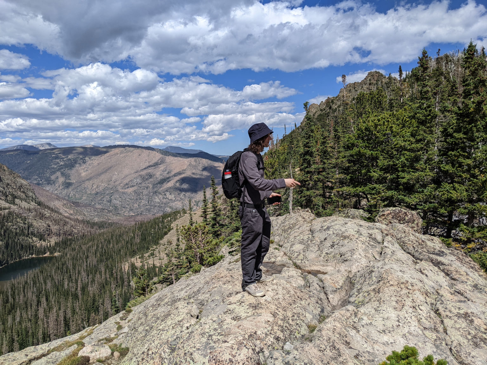

It's early September, still hot, rainier than I remember in seasons past, and
the crickets chirp loudly late into the night.

Work is coming along slowly but nicely for my tiny solitaire video game. The
underlying goal is to return to developing my primary creative pursuit, Nature
Elsewhere. By completion of solitaire, I hope to have established my own little
from-scratch platform for expression that I can build upon as a necessary
side-effect.

## Sawfish Solitaire and Naming

If only to keep things simple, I've resolved to abandon
[all of the Sawfish ideas in the last post](../2022-06-29) except for the
inexplicable Patience the Demon and the card faces which will be semi-nature or
evolution themed. This cool color variation of the oidoid logo didn't make the
cut either:

[](oidoid.png)

I've also dropped the Sawfish Solitaire name. The new working title is Sublime
Solitaire which I chose using my usual constraint of .com availability. I picked
the name using some JavaScript-y approximation of
[the CD Baby guy's method](https://sive.rs/com) for finding available .com
domains. I've published the code under
[whois-local](https://github.com/niedzielski/whois-local). I will probably
change the name again.

I'm glad I don't have to keep using the whois command-line tool which, due to
multiple domain scoops, has me paranoid whether my queries are as private as I
thought.

## Pixel Perfect WebGL

Exact pixel graphics are essential to what I wish to express. I chose pixel art
in part to do something small well. Yet, inconsistencies have plagued
development from the beginning (years!). It was a major motivation to build my
own game engine instead of using an existing one like Phaser 2.

### One Pixel Is a Lot

These glitches are often subtle for many graphics and only occur in specific
configurations. In the following real example, a column of pixels is truncated
out of the middle of the canvas on a certain window size as I changed the
browser zoom level:

[](pixel-glitches.gif)

I would be unlikely to notice the above inconsistency in a static image due to
the nature of the illustration. However, the bug is glaring for some renders. I
think the vertical card borders, in this case, would probably be the most
noticeable single pixel difference.

The magnitude of the issue is difficult to convey but maybe a comparable musical
analogy is that it's like being off-key or a little out of sync. You might not
notice it in some songs but it would ruin others and, as a musician, you have to
fix it or learn to incorporate it.

### Ideal

In time, I identified the desired behavior as something like:

1. Given sufficient physical or native pixels, the camera will be guaranteed to
   be at least a minimum width and height. Assuming a minimum working area makes
   it easier to build screens and levels. In solitaire, for example, a minimum
   width guarantees the tableau piles can always be laid out horizontally.
2. The minimum camera area will be scaled to the greatest integer where both the
   scaled width and scaled height fit. Any remaining space will be rendered as
   well. Eg, a minimum camera of 160 px × 144 px could render at 2x in a 320 px²
   window with an additional 32 px × 320 px rendered. Shrinking the window or
   available native pixels will shrink the level scale as needed to ensure the
   working area is always rendered.
3. The scaled or level pixels may not be a multiple of the native window
   dimensions. Up to one level pixel (technically, `scale - 1` px) will be
   clipped by the window on both axes as needed.
4. The browser zoom will be totally inert since the native pixels available is
   unchanging.
5. No fancy portrait / landscape flipping initially.

### Too Many Variables

There's a ridiculous number of variables that effect scaling, some
interdependent, including:

- Window or client size.
- Body dimensions (`width` and `height`), `margin`, and `overflow`.
- Canvas attribute dimensions.
- Canvas `display`, `image-rendering`, and `width` and `height` style
  properties.
- Browser zoom and `devicePixelRatio`.
- Minimum camera size and the camera transform.

The above along with the usual compounding factors of development, such as no
real integer type, has made this a tricky interplay of bugs to solve.

### Altogether

When it's working properly, a rendered checkerboard pattern will appear uniform
and doesn't change size at any browser zoom. In practice, I've found it to be
the most effective and confident test.

[](pixel-perfect.png)

In my thinking, truncating the last level pixel on both axes as needed is the
best tradeoff. Highlighted in red in the above example (click for a larger
view), you can see the the last level pixel gets truncated by the window
depending on dimensions as the scaled pixel is not necessarily an even multiple
of the native window size. At first I thought, "I think I can render that last
partial level pixel correctly instead of letting the window halve it," but then
I realized that even if I did render it as a half-pixel, it would look identical
and _appear_ truncated by the window. Worse, the camera would have to be
represented with fractional values instead of integral.

The other approach I considered is that if the partial pixel was omitted by
shrinking the camera width to 415 px (`Math.floor( window / scale )` instead of
`Math.ceil()`), the window would have an unrendered native 1 px gap (.5 level
pixels). However, this gap can be as large as `scale - 1` so I think going over
most frequently looks best.

I'm probably about as satisfied as I'll ever be with the solution. It doesn't
force a window size on the user, the UI (only Patience and the background right
now) can follow the screen edge at nice tile-sized intervals to keep the rhythm,
and the scaling is perfectly proportional integers. The only shortcoming is the
last column and row may be truncated. If I keep the minimum camera size a
multiple of common display dimensions, full-screen will often be pixel perfect.

Tangentially, I've also added a crisp 16 px² favicon.

## Simpler, Faster Sprites

Sprites are rendering primitives and they've received some major simplifications
recently.

### On GPU Sprite Look-ups

In the prior implementation, sprites were not tile-based. They could be any size
so stitching together multiple tiles into meta-tile sprites was never necessary
(except for layering and composition effects). I've retained that design but
previously the renderer would send the source image location (x, y, width, and
height) for every sprite _instance_. Now, a look-up table by animation ID is
loaded on the GPU once. This provides the same functionality and reduces bytes
sent to a two-byte identifier instead of eight but more importantly, simplifies
the sprite data layout to be as basic as a tile-based sprite. This kind of dead
simple mapping between atlas source and render destination is easier to think
about: "The only supported source is a predefined region specified by ID. I can
map this source image to anywhere in the level at any size."

### No More Sprite Sorting and Fewer Layers

Nature Elsewhere used
[the painter's algorithm](https://wikipedia.org/wiki/Painter's_algorithm) to
draw sprites on top of each other in the correct order. Of note, the old naive
implementation did all sorting on the CPU. The new implementation converts a
logical layer like "Background" to a z-depth and discards any covered fragments,
which allows the GPU to compose all the sprites regardless of order.
[This OpenGL z-buffer article presents the topic well](https://www.patternsgameprog.com/opengl-2d-facade-24-z-buffer).

In Nature Elsewhere, if two sprites were on the same layer, I often wanted the
sprite further down the screen to appear in front. For example, a tree sprite
should be rendered in front of a bee sprite if the bottom of the tree was
further down the screen than the bee and vice versa. The painter's algorithm
often worked well for this: sort by later and within a layer sort by
`y + spriteHeight`. However, one case it didn't work well for was UI which had
an escalating layer / z-index battle like "UILo", "UIMid", "UIHi", and "UIHiHi"
to support composing dialog borders, dialog backgrounds, button borders, and
button text in the correct order. I think I also had to use masking.

```
+-------------------------------------+
| Dialog border                       |
| +----------------------------------+|
| | Dialog background                ||
| |     +----------------+           ||
| |     | Button border  |           ||
| |     | +-------------+|           ||
| |     | | Button text ||           ||
| |     | +-------------+|           ||
| |     +----------------+           ||
| +----------------------------------+|
+-------------------------------------+
```

The new renderer simplifies intra-layer resolution by adding a bit for flagging
whether a sprite on a given layer should be sorted by the start or the end
position. This is only used to resolve order within a layer. In the above
example, the dialog border is large and spans the from the top of the screen to
the bottom. If I flag that intra-layer order conflicts should be resolved by the
end position, the border will always "win" (be drawn in front) because it
extends to the bottom of the screen. However, if I flag that the top of the
sprite should be used, it'll never win and be drawn in the back because it
starts at the top of the screen.

### Multi-sprite Entities

In general, I want to avoid layering and multi-sprite entities as they were a
source of complexity in the old Nature Elsewhere implementation. It's easy to
imagine the cards being composed in-game from a suit sprite, rank sprite, face
sprite, and card blank sprite but in the spirit of simplicity I've pre-baked all
the cards as single sprite entities. This increases the sprite sheet size but
they're not animated so there's room to spare. I still do some layering with the
UI backgrounds though and would like to explore a better masking and composition
in a
[9-patch](https://developer.android.com/develop/ui/views/graphics/drawables#nine-patch)-like
sprite implementation, something I never got far into in past Nature Elsewhere
work.

### More Bitflags

I've started using bitflags over dedicated fields. Presumably, there's a
microscopic performance penalty for masking out writes correctly but reads and
GPU transmission are essentially free and the sprite primitive stays nicely
compact whether it needs to leverage special flags or not.
[JavaScript safe integers are 53-bits wide](https://developer.mozilla.org/docs/Web/JavaScript/Reference/Global_Objects/Number/MAX_SAFE_INTEGER)
(6+ bytes) and I anticipate most of the data in my games will be 16 bits or
less, so there's lots of room.

As an example, texture wrapping offsets are now two nibbles (one byte). I use
texture wrapping in several places of Nature Elsewhere including rain and
[marching-ants](https://wikipedia.org/wiki/Marching_ants) UI. However, most
sprites do not care and don't have to carry around extra fields (four bytes
whether it was used or not) for these special cases. I am much more excited for
the slimmer, simpler sprites than the performance savings.

### Apple Won

Some years back I was shocked to find that all my devices supported WebGL v2
which had been out for a long time but my partner's iPad did not. Apparently, it
was well-known that Apple devices only supported WebGL v1 so I had to downgrade
but I imagined myself in a personal competition to release Nature Elsewhere
before Apple released WebGL v2 support. Well, they won so now I'm back on v2 and
there were some modest improvements to the renderer. It's mostly just nice to
not have to worry about v1-specifics.

It will be neat to see what WebGPU brings and I hope to one day publish a Deno
desktop WebGPU app without too much cruft.

## Making Due with Make

I had some deep experiences with GNU Make early in my professional life that
left a mark. I am continually surprised that I haven't found a modern
alternative for it, perhaps Rust-based, that eliminates it's innumerable
foot-guns, scalability issues, unfun syntax, and other limitations. The closest
I've seen is [just](https://github.com/casey/just) which looks promising but
unfortunately keeps some of the syntax I dislike and drops all file-based
dependency support. Make is just so useful so, once again, I somehow find myself
using Make.

In recent years, I had been using a crufty
[shebang trick](https://github.com/niedzielski/shebang/blob/e7bfa9d6392ac34bd0702631ca01fd1ec678465e/demo/make#L2)
to mark the makefile itself as executable and force a bunch of useful command
line flags like `--jobs` and `--warn-undefined-variables`. Not long ago, some
wild child even added the `--split-string` flag to env so you can put it all in
the shebang itself. Nevertheless, I didn't like the shebang approach because
it's less obvious what a script called `make` does when you encounter a new
project vs `makefile` or `package.json`, it's a little more comfortable to type
`make` than `./make`, and the strange mix of shell and Make syntax confuses my
editor.

Many of these command-line flags have special variable equivalents like
[`MAKEFLAGS`](https://www.gnu.org/software/make/manual/make.html#Options_002fRecursion),
allowing for much nicer vanilla makefiles.
[I've captured my current thinking in this template](https://github.com/niedzielski/makefile-skeleton).
In doing so, and just when I thought "oh, I've finally got all this crup
sorted," I stumbled over
[some 20+ year old bug](https://savannah.gnu.org/bugs/?9060) that I think was
why I stared using the shebang approach. In discourse, however, it turns out to
have already been fixed (!) but
[the last release of Make](https://git.savannah.gnu.org/cgit/make.git/tag/?h=4.3)
was a couple years back. I look forward to the next release.

One last thing I think I only recently realized was that I can de facto fork
pretty painlessly in a makefile by virtue of using `--jobs` which I want on
anyway. Any recipes that have long-running processes like watchers execute in
their own job so no fancy traps are really needed so far as I know.

I think I started using Make at v3.80 for Cygwin. It's nice that it only took me
14 years or so to draw these conclusions.

## Entities, Components, Systems

I built out the most modest ECS I could after reading this article on
[a simple TypeScript implementation](https://maxwellforbes.com/posts/typescript-ecs-implementation)
and another on
[a performant C version](https://austinmorlan.com/posts/entity_component_system).
It's very early in development and I haven't made any performance improvements
but I really like how its isolated what should be disparate pieces of game
logic. In some ways, it doesn't seem too far from what I had previously, and
adapting my "follow cam" ECS-like to a more proper ECS required few changes, for
instance, but the concepts are a lot clearer to me.

## JavaScript Integral Types

I am still waffling a bit on my branded type implementation for integer values.
I'm pretty happy with it overall and have written it such that supporting widths
from U4/I4 to U32/I32 is a minimum of code but maybe I should switch to bigints.

## Input Profiling

I've adding some input latency measurements to my input states and plan to
expose these in some kind of debug pane. Pointer events are maybe 6 ms behind on
average but, when using a stylus, the delay feels much longer.

## Summer's End

So, everything seems to be coming together nicely and many of the problems I've
had historically in Nature Elsewhere and before have been dissolving in really
pleasing ways. Maybe I'm benefiting from prior experience, improved tools,
having some distance from the problems, more study time, many smaller projects
in-between, or all of the aforementioned. Whatsoever the reason, I can't wait to
get this big monorepo-ish platform put together and published.

Programming is at the center of my life. I had a wonderful trip to Rocky
Mountain National Park and I bought two bucket hats last week.

[](stephen-2022-08-30.jpeg)
