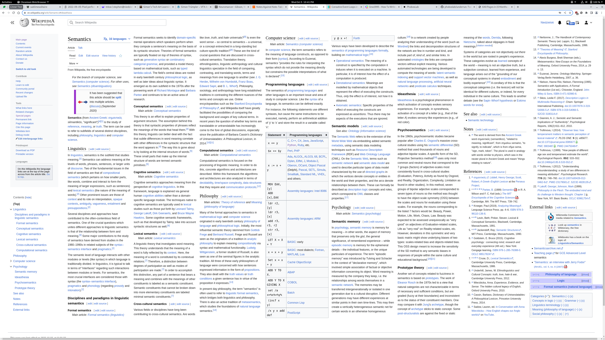

I can't stop thinking about newspaper-like layouts with many narrow columns.

In the current single wide-column layout on niedzielski.com, there is an unhappy
tension between

1. wanting that column to be narrow enough for the eye to easily track from the
   end of one line to the start of the next (ie, not classic Wikipedia), and
2. making that narrow column excessively long while the left and right remain
   empty voids.

At time of writing, the design looks like:

<video controls width=704 src=niedzielski.com-single-column-2022-11-06.webm></video>

Ignoring the rough edges, the same article in a multi-columnar layout with
column snapping.

<video controls width=704 src=niedzielski.com-multi-column-2022-11-06.webm></video>

(This
[article on multi-column CSS](https://www.smashingmagazine.com/2019/01/css-multiple-column-layout-multicol/)
helped me prototype the above.)

So, here are the pros as I see them:

- Narrow columns are easiest to read.
- Multi-column layouts have excellent content density.
- Inline images don't need to be huge.
- Improved content density reduces scrolling.

Juxtaposed with the cons:

- Scrolling is cumbersome. On desktop, I usually shift-scroll to advance the
  content and I don't think many people know about that. On a phone, it's
  interestingly just a single-column with paging.
- The design is unfamiliar.
- The content density can be overwhelming.
- Customizing presentation isn't well supported. It's hard to do anything beyond
  the basics across form-factors. Styling is quite limited and challenging.
- Many other content types (images, video, code, etc) often don't fit well.
  These need to opened in a dedicated dialog-like viewer.
- The eye jump from the bottom of one column to the top of another is a full
  screen.

What's friendliest? Probably single wide-column. I just don't think multi-column
is really a practical template for most content I write.

A larger screenshot of the above:

[](niedzielski.com-multi-column-2022-10-05.png)

A similar screenshot but for Wikipedia with a multi-column experimental style:

[](wikipedia-multi-column-2022-10-05.png)

A book layout:

[](neuromancer-2022-10-12.png)
_Scan by [Internet Archive](https://archive.org) from
[Neuromancer](https://archive.org/details/neuromancer0000gibs_b5r9/page/4/mode/2up?view=theater);
© 1984 William Gibson._

<div style='column-span: all'>

Interestingly, lynx also dumps a single column layout.

<!-- deno-fmt-ignore-start -->
```
  $ lynx -dump niedzielski.com/log/2022-09-05
       * [1]NIEDZIELSKI
       * [2]Works
       * [3]Notes
       * [4]Log
       * [5]Profile
  
  [6]#2022-09-05: Pixel perfect
  
     Some longstanding game development challenges resolve nicely.
  
     It's early September, still hot, rainier than I remember in seasons
     past, and the crickets chirp loudly late into the night.
  
     Work is coming along slowly but nicely for my tiny solitaire video
     game. The underlying goal is to return to developing my primary
     creative pursuit, Nature Elsewhere. By completion of solitaire, I hope
     to have established my own little from-scratch platform for expression
     that I can build upon as a necessary side-effect.
  
  [7]#Sawfish Solitaire and naming
  
     If only to keep things simple, I've resolved to abandon [8]all of the
     Sawfish ideas in the last post except for the inexplicable Patience the
     Demon and the card faces which will be semi-nature or evolution themed.
     This cool color variation of the oidoid logo didn't make the cut
     either:
  
     [9]The oidoid logo.
  
     I've also dropped the Sawfish Solitaire name. The new working title is
     Sublime Solitaire which I chose using my usual constraint of .com
     availability. I picked the name using some JavaScript-y approximation
     of [10]the CD Baby guy's method for finding available .com domains.
     I've published the code under [11]whois-local. I will probably change
     the name again.
  
     I'm glad I don't have to keep using the whois command-line tool which,
     due to multiple domain scoops, has me paranoid whether my queries are
     as private as I thought.
  
  [12]#Pixel perfect WebGL
  
     Exact pixel graphics are essential to what I wish to express. I chose
     pixel art in part to do something small well. Yet, inconsistencies have
     plagued development from the beginning (years!). It was a major
     motivation to build my own game engine instead of using an existing one
     like Phaser 2.
  
  [13]#One pixel is a lot
  
     These glitches are often subtle for many graphics and only occur in
     specific configurations. In the following real example, a column of
     pixels is truncated out of the middle of the canvas on a certain window
     size as I changed the browser zoom level:
  
     [14]Example of pixel glitches.
  
     I would be unlikely to notice the above inconsistency in a static image
     due to the nature of the illustration. However, the bug is glaring for
     some renders. I think the vertical card borders, in this case, would
     probably be the most noticeable single pixel difference.
  
     The magnitude of the issue is difficult to convey but maybe a
     comparable musical analogy is that it's like being off-key or a little
     out of sync. You might not notice it in some songs but it would ruin
     others and, as a musician, you have to fix it or learn to incorporate
     it.
  
  [15]#Ideal
  
     In time, I identified the desired behavior as something like:
      1. Given sufficient physical or native pixels, the camera will be
         guaranteed to be at least a minimum width and height. Assuming a
         minimum working area makes it easier to build screens and levels.
         In solitaire, for example, a minimum width guarantees the tableau
         piles can always be laid out horizontally.
      2. The minimum camera area will be scaled to the greatest integer
         where both the scaled width and scaled height fit. Any remaining
         space will be rendered as well. Eg, a minimum camera of 160 px ×
         144 px could render at 2x in a 320 px² window with an additional 32
         px × 320 px rendered. Shrinking the window or available native
         pixels will shrink the level scale as needed to ensure the working
         area is always rendered.
      3. The scaled or level pixels may not be a multiple of the native
         window dimensions. Up to one level pixel (technically, scale - 1
         px) will be clipped by the window on both axes as needed.
      4. The browser zoom will be totally inert since the native pixels
         available is unchanging.
      5. No fancy portrait / landscape flipping initially.
  
  [16]#Too many variables
  
     There's a ridiculous number of variables that effect scaling, some
     interdependent, including:
       * Window or client size.
       * Body dimensions (width and height), margin, and overflow.
       * Canvas attribute dimensions.
       * Canvas display, image-rendering, and width and height style
         properties.
       * Browser zoom and devicePixelRatio.
       * Minimum camera size and the camera transform.
  
     The above along with the usual compounding factors of development, such
     as no real integer type, has made this a tricky interplay of bugs to
     solve.
  
  [17]#Altogether
  
     When it's working properly, a rendered checkerboard pattern will appear
     uniform and doesn't change size at any browser zoom. In practice, I've
     found it to be the most effective and confident test.
  
     [18]Example of as pixel perfect as it gets.
  
     In my thinking, truncating the last level pixel on both axes as needed
     is the best tradeoff. Highlighted in red in the above example (click
     for a larger view), you can see the the last level pixel gets truncated
     by the window depending on dimensions as the scaled pixel is not
     necessarily an even multiple of the native window size. At first I
     thought, "I think I can render that last partial level pixel correctly
     instead of letting the window halve it," but then I realized that even
     if I did render it as a half-pixel, it would look identical and appear
     truncated by the window. Worse, the camera would have to be represented
     with fractional values instead of integral.
  
     The other approach I considered is that if the partial pixel was
     omitted by shrinking the camera width to 415 px (Math.floor( window /
     scale ) instead of Math.ceil()), the window would have an unrendered
     native 1 px gap (.5 level pixels). However, this gap can be as large as
     scale - 1 so I think going over most frequently looks best.
  
     I'm probably about as satisfied as I'll ever be with the solution. It
     doesn't force a window size on the user, the UI (only Patience and the
     background right now) can follow the screen edge at nice tile-sized
     intervals to keep the rhythm, and the scaling is perfectly proportional
     integers. The only shortcoming is the last column and row may be
     truncated. If I keep the minimum camera size a multiple of common
     display dimensions, full-screen will often be pixel perfect.
  
     Tangentially, I've also added a crisp 16 px² favicon.
  
  [19]#Simpler, faster sprites
  
     Sprites are rendering primitives and they've received some major
     simplifications recently.
  
  [20]#On GPU sprite look-ups
  
     In the prior implementation, sprites were not tile-based. They could be
     any size so stitching together multiple tiles into meta-tile sprites
     was never necessary (except for layering and composition effects). I've
     retained that design but previously the renderer would send the source
     image location (x, y, width, and height) for every sprite instance.
     Now, a look-up table by animation ID is loaded on the GPU once. This
     provides the same functionality and reduces bytes sent to a two-byte
     identifier instead of eight but more importantly, simplifies the sprite
     data layout to be as basic as a tile-based sprite. This kind of dead
     simple mapping between atlas source and render destination is easier to
     think about: "The only supported source is a predefined region
     specified by ID. I can map this source image to anywhere in the level
     at any size."
  
  [21]#No more sprite sorting and fewer layers
  
     Nature Elsewhere used [22]the painter's algorithm to draw sprites on
     top of each other in the correct order. Of note, the old naive
     implementation did all sorting on the CPU. The new implementation
     converts a logical layer like "Background" to a z-depth and discards
     any covered fragments, which allows the GPU to compose all the sprites
     regardless of order. [23]This OpenGL z-buffer article presents the
     topic well.
  
     In Nature Elsewhere, if two sprites were on the same layer, I often
     wanted the sprite further down the screen to appear in front. For
     example, a tree sprite should be rendered in front of a bee sprite if
     the bottom of the tree was further down the screen than the bee and
     vice versa. The painter's algorithm often worked well for this: sort by
     later and within a layer sort by y + spriteHeight. However, one case it
     didn't work well for was UI which had an escalating layer / z-index
     battle like "UILo", "UIMid", "UIHi", and "UIHiHi" to support composing
     dialog borders, dialog backgrounds, button borders, and button text in
     the correct order. I think I also had to use masking.
  +-------------------------------------+
  | Dialog border                       |
  | +----------------------------------+|
  | | Dialog background                ||
  | |     +----------------+           ||
  | |     | Button border  |           ||
  | |     | +-------------+|           ||
  | |     | | Button text ||           ||
  | |     | +-------------+|           ||
  | |     +----------------+           ||
  | +----------------------------------+|
  +-------------------------------------+
  
     The new renderer simplifies intra-layer resolution by adding a bit for
     flagging whether a sprite on a given layer should be sorted by the
     start or the end position. This is only used to resolve order within a
     layer. In the above example, the dialog border is large and spans the
     from the top of the screen to the bottom. If I flag that intra-layer
     order conflicts should be resolved by the end position, the border will
     always "win" (be drawn in front) because it extends to the bottom of
     the screen. However, if I flag that the top of the sprite should be
     used, it'll never win and be drawn in the back because it starts at the
     top of the screen.
  
  [24]#Multi-sprite entities
  
     In general, I want to avoid layering and multi-sprite entities as they
     were a source of complexity in the old Nature Elsewhere implementation.
     It's easy to imagine the cards being composed in-game from a suit
     sprite, rank sprite, face sprite, and card blank sprite but in the
     spirit of simplicity I've pre-baked all the cards as single sprite
     entities. This increases the sprite sheet size but they're not animated
     so there's room to spare. I still do some layering with the UI
     backgrounds though and would like to explore a better masking and
     composition in a [25]9-patch-like sprite implementation, something I
     never got far into in past Nature Elsewhere work.
  
  [26]#More bitflags
  
     I've started using bitflags over dedicated fields. Presumably, there's
     a microscopic performance penalty for masking out writes correctly but
     reads and GPU transmission are essentially free and the sprite
     primitive stays nicely compact whether it needs to leverage special
     flags or not. [27]JavaScript safe integers are 53-bits wide (6+ bytes)
     and I anticipate most of the data in my games will be 16 bits or less,
     so there's lots of room.
  
     As an example, texture wrapping offsets are now two nibbles (one byte).
     I use texture wrapping in several places of Nature Elsewhere including
     rain and [28]marching-ants UI. However, most sprites do not care and
     don't have to carry around extra fields (four bytes whether it was used
     or not) for these special cases. I am much more excited for the
     slimmer, simpler sprites than the performance savings.
  
  [29]#Apple won
  
     Some years back I was shocked to find that all my devices supported
     WebGL v2 which had been out for a long time but my partner's iPad did
     not. Apparently, it was well-known that Apple devices only supported
     WebGL v1 so I had to downgrade but I imagined myself in a personal
     competition to release Nature Elsewhere before Apple released WebGL v2
     support. Well, they won so now I'm back on v2 and there were some
     modest improvements to the renderer. It's mostly just nice to not have
     to worry about v1-specifics.
  
     It will be neat to see what WebGPU brings and I hope to one day publish
     a Deno desktop WebGPU app without too much cruft.
  
  [30]#Making due with Make
  
     I had some deep experiences with GNU Make early in my professional life
     that left a mark. I am continually surprised that I haven't found a
     modern alternative for it, perhaps Rust-based, that eliminates it's
     innumerable foot-guns, scalability issues, unfun syntax, and other
     limitations. The closest I've seen is [31]just which looks promising
     but unfortunately keeps some of the syntax I dislike and drops all
     file-based dependency support. Make is just so useful so, once again, I
     somehow find myself using Make.
  
     In recent years, I had been using a crufty [32]shebang trick to mark
     the makefile itself as executable and force a bunch of useful command
     line flags like --jobs and --warn-undefined-variables. Not long ago,
     some wild child even added the --split-string flag to env so you can
     put it all in the shebang itself. Nevertheless, I didn't like the
     shebang approach because it's less obvious what a script called make
     does when you encounter a new project vs makefile or package.json, it's
     a little more comfortable to type make than ./make, and the strange mix
     of shell and Make syntax confuses my editor.
  
     Many of these command-line flags have special variable equivalents like
     [33]MAKEFLAGS, allowing for much nicer vanilla makefiles. [34]I've
     captured my current thinking in this template. In doing so, and just
     when I thought "oh, I've finally got all this crup sorted," I stumbled
     over [35]some 20+ year old bug that I think was why I stared using the
     shebang approach. In discourse, however, it turns out to have already
     been fixed (!) but [36]the last release of Make was a couple years
     back. I look forward to the next release.
  
     One last thing I think I only recently realized was that I can de facto
     fork pretty painlessly in a makefile by virtue of using --jobs which I
     want on anyway. Any recipes that have long-running processes like
     watchers execute in their own job so no fancy traps are really needed
     so far as I know.
  
     I think I started using Make at v3.80 for Cygwin. It's nice that it
     only took me 14 years or so to draw these conclusions.
  
  [37]#Entities, Components, Systems
  
     I built out the most modest ECS I could after reading this article on
     [38]a simple TypeScript implementation and another on [39]a performant
     C version. It's very early in development and I haven't made any
     performance improvements but I really like how its isolated what should
     be disparate pieces of game logic. In some ways, it doesn't seem too
     far from what I had previously, and adapting my "follow cam" ECS-like
     to a more proper ECS required few changes, for instance, but the
     concepts are a lot clearer to me.
  
  [40]#JavaScript integral types
  
     I am still waffling a bit on my branded type implementation for integer
     values. I'm pretty happy with it overall and have written it such that
     supporting widths from U4/I4 to U32/I32 is a minimum of code but maybe
     I should switch to bigints.
  
  [41]#Input profiling
  
     I've adding some input latency measurements to my input states and plan
     to expose these in some kind of debug pane. Pointer events are maybe 6
     ms behind on average but, when using a stylus, the delay feels much
     longer.
  
  Summer's end
  
     So, everything seems to be coming together nicely and many of the
     problems I've had historically in Nature Elsewhere and before have been
     dissolving in really pleasing ways. Maybe I'm benefiting from prior
     experience, improved tools, having some distance from the problems,
     more study time, many smaller projects in-between, or all of the
     aforementioned. Whatsoever the reason, I can't wait to get this big
     monorepo-ish platform put together and published.
  
     Programming is at the center of my life. I had a wonderful trip to
     Rocky Mountain National Park and I bought two bucket hats last week.
  
     [42]As good as it gets.
     © Stephen Niedzielski. This page was published on 2022-09-05 and
     modified 2022-09-05.
  
  References
  
     1. https://niedzielski.com/
     2. https://niedzielski.com/works
     3. https://niedzielski.com/notes
     4. https://niedzielski.com/log
     5. https://niedzielski.com/stephen
     6. https://niedzielski.com/log/2022-09-05/#title
     7. https://niedzielski.com/log/2022-09-05/#sawfish-solitaire-and-naming
     8. https://niedzielski.com/log/2022-06-29
     9. https://niedzielski.com/log/2022-09-05/oidoid.png
    10. https://sive.rs/com
    11. https://github.com/niedzielski/whois-local
    12. https://niedzielski.com/log/2022-09-05/#pixel-perfect-webgl
    13. https://niedzielski.com/log/2022-09-05/#one-pixel-is-a-lot
    14. https://niedzielski.com/log/2022-09-05/pixel-glitches.gif
    15. https://niedzielski.com/log/2022-09-05/#ideal
    16. https://niedzielski.com/log/2022-09-05/#too-many-variables
    17. https://niedzielski.com/log/2022-09-05/#altogether
    18. https://niedzielski.com/log/2022-09-05/pixel-perfect.png
    19. https://niedzielski.com/log/2022-09-05/#simpler-faster-sprites
    20. https://niedzielski.com/log/2022-09-05/#on-gpu-sprite-look-ups
    21. https://niedzielski.com/log/2022-09-05/#no-more-sprite-sorting-and-fewer-layers
    22. https://wikipedia.org/wiki/Painter's_algorithm
    23. https://www.patternsgameprog.com/opengl-2d-facade-24-z-buffer
    24. https://niedzielski.com/log/2022-09-05/#multi-sprite-entities
    25. https://developer.android.com/develop/ui/views/graphics/drawables#nine-patch
    26. https://niedzielski.com/log/2022-09-05/#more-bitflags
    27. https://developer.mozilla.org/docs/Web/JavaScript/Reference/Global_Objects/Number/MAX_SAFE_INTEGER
    28. https://wikipedia.org/wiki/Marching_ants
    29. https://niedzielski.com/log/2022-09-05/#apple-won
    30. https://niedzielski.com/log/2022-09-05/#making-due-with-make
    31. https://github.com/casey/just
    32. https://github.com/niedzielski/shebang/blob/e7bfa9d6392ac34bd0702631ca01fd1ec678465e/demo/make#L2
    33. https://www.gnu.org/software/make/manual/make.html#Options_002fRecursion
    34. https://github.com/niedzielski/makefile-skeleton
    35. https://savannah.gnu.org/bugs/?9060
    36. https://git.savannah.gnu.org/cgit/make.git/tag/?h=4.3
    37. https://niedzielski.com/log/2022-09-05/#entities-components-systems
    38. https://maxwellforbes.com/posts/typescript-ecs-implementation
    39. https://austinmorlan.com/posts/entity_component_system
    40. https://niedzielski.com/log/2022-09-05/#javascript-integral-types
    41. https://niedzielski.com/log/2022-09-05/#input-profiling
    42. https://niedzielski.com/log/2022-09-05/stephen-2022-08-30.jpeg
```
<!-- deno-fmt-ignore-end -->

</div>

## Black and white

<div style='column-span: all'>

The other day I read the most interesting quote on
[the Casablanca Wikipedia article](https://en.wikipedia.org/w/index.php?oldid=1117277663#Colorization):

> "If you're going to colorize Casablanca, why not put arms on the Venus de
> Milo?" ―Stephen Humphrey Bogart

[](venus-de-milo.jpeg) _Photo by
[Livioandronico2013](https://commons.wikimedia.org/wiki/User:Livioandronico2013)
from the
[Venus de Milo Wikipedia article](https://wikipedia.org/wiki/Venus_de_Milo);
distributed under a
[CC BY-SA 4.0 license](https://creativecommons.org/licenses/by-sa/4.0/deed.en)._

Both would restore something lost. So fun to think on!

</div>

## Sublime Solitaire

Solitaire is feature complete! So much work left to do in refactoring, bug
fixing, getting the repo in a state to publish, and drawing all the card art but
the long, long slog of feature work like rebuilding the renderer from scratch
has wrapped up and most of the remaining lengthy tasks are enjoyable and easily
approached in any state of drowsiness, if only because the scope feels finite.
I've even started pushing code again!!

### Num, XY, and Box

Those [integer](https://github.com/oidoid/oidlib/blob/318572b/src/types/Num.ts),
[Cartesian pair](https://github.com/oidoid/oidlib/blob/318572b/src/2d/XY.ts),
and [rectangle](https://github.com/oidoid/oidlib/blob/318572b/src/2d/Box.ts)
datums I was bragging about being "a minimum of code" have exploded in size and
complexity.

The implementations are gnarly but the API has worked well enough so far. I
think my primary complaints are:

- The implementation is very hard to read and weird.
- The many pros and cons of using a branded data type instead of a nominal
  class.

### Num

The number APIs look like this:

<!-- deno-fmt-ignore-start -->
```ts
  let i = I4(-4) // Make a signed nibble of value -4.
  i = I4(i + 8) // Add 8 to it, 4.
  try {
    i = I4(i + 4) // Try to add 4 more (throws), 4.
  } catch {}
  i = I4.floor(i + 4.5) // Saturating add 4.5, 7.
```
<!-- deno-fmt-ignore-end -->

I think I've worked out all the issues save one, bitcasts. What I mean is,
interpreting a JavaScript number as a two's complement encoded value, not a
logical number. I use BigInts to support the full range of Number and it doesn't
quite fit in with the rest of the implementation so I am thinking on that more.

Rebranding Num types as other types like `Millis` seem to work well.

I think everything else is doing ok actually.

### XY

I've dropped WH, width-height, to focus on a single Cartesian pair type, XY.
It's a monster at close to 500 lines of odd, hard-to-read code. However, it
supports the complete variety of Num types (I4, I8, I16, I32, Int, Number, and
the corresponding unsigned variants) with a variety of useful arithmetic methods
(add, subtract, divide, multiply) and other operations like area, lerp, and
absolute value. All methods support the complete pack of Num conversions
wherever it makes sense: truncate, round, floor, ceiling, modulo, and clamp
which has been super useful to have abstracted.

This type doesn't work as well as Num though:

- Unlike Num, XY doesn't magically unwrap in arithmetic operations like
  `IntXY(1, 2) + IntXY(3, 4)` which wouldn't compile. You have to use the
  corresponding method like `IntXY.add(IntXY(1, 2), 3, 4)`.
- XY required it's own layer of branding beyond Num because it's a mutable
  non-primitive. I had to take care to forbid mixing wide methods with narrow
  types like `I16XY.add(I8XY(1, 1), 1000, 1000)`. For Nums like I16, this still
  makes sense since it'll return a new I16 but `I16XY` mutates in-place which
  would silently create invalid out-of-bounds states.

The only other issue I've noticed is if you spread an XY into another type, then
you brand that type, and I haven't thought about what the implications are of
that enough.

The API seems to be hiding things well in how I use it at least:

<!-- deno-fmt-ignore-start -->
```ts
  const xy = U32XY(1, 2) // Make an unsigned 32b XY pair, (1, 2).
  U32XY.add(xy, 4, 8) // Add (4, 8), (5, 10).
  U32XY.divRound(xy, 2, 2) // Divide by 2 and round, (3, 5).
  try {
    U32XY.mul(xy, IntXY(-1, -1)) // Try to multiply by -1 (throws), (3, 5).
  } catch {}
```
<!-- deno-fmt-ignore-end -->

The APIs all return the location value (`xy` in the above example) and will look
much nicer if the
[pipeline operator](https://github.com/tc39/proposal-pipeline-operator) succeeds
but still a bit clumsy.

### Box

Any problems I had with Num and XY flowed upwards into Box, two points
describing a rectangle, which builds on both. At close to 700 lines of
convoluted code, it's the kind of implementation that makes one wonder how one
is _spending their life_.

So far, everything about the XY API applies to Box and compounds. I don't think
I could compose another layer on top of Box with the full variation of all the
Num types and conversions as they really start ballooning and readability
dwindles.

Here's a usage example:

<!-- deno-fmt-ignore-start -->
```ts
  // Make a signed 16b box starting at (10, 10) and ending at (490, 330),
  // [(10, 10), (490, 330)].
  const cam = I16Box(10, 10, 480, 320)
  function toLevelXY(
    point: Readonly<NumberXY>,
    clientViewportWH: Readonly<NumberXY>,
    cam: Readonly<I16Box>,
  ): I16XY {
    return I16XY.trunc(
      cam.start.x + (point.x / clientViewportWH.x) * I16Box.width(cam),
      cam.start.y + (point.y / clientViewportWH.y) * I16Box.height(cam),
    )
  }
```
<!-- deno-fmt-ignore-end -->

### Make

There's
[a new release of Make](https://git.savannah.gnu.org/cgit/make.git/tag/?h=4.4)!
[It has the fix I've been waiting for](https://savannah.gnu.org/bugs/?9060)! Who
knows when Debian stable will get it but now it's inevitable.

## Next

As I inch along on the remaining Sublime Solitaire work, trying to build a
friendly platform for efficient expression, I think about what's next. I'm
really excited to rebuild Nature Elsewhere and / or Linear Text! I have
everything I need except time.
