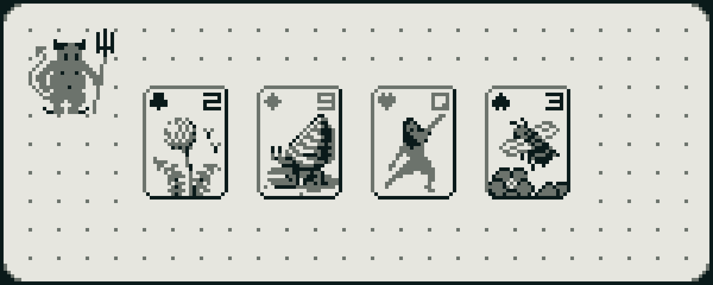

We're a month into 2023 and I've been wanting to write for a long while.

## So Long, Fritz

Our family cat of many years has died. Fritz was my constant companion
since 2012. His lifelong health problems were a great burden, but his
disposition was as warm and gentle as sunlight.

It's been hard to get over the loss of my small friend. He was such an
inseparable part of my days for so long. He was just always there. Now, I'm
still here in the same place and he's not. I cycle back around on everyday
going-ons where last time through he was still here. All his empty little beds
scattered about the house the day after.

The choice to deliberately end his life was hard to make. My partner spent most
of the night before with him. Despite best efforts, he wasn't eating. On his
last day, he stopped drinking.

The appointment was in the early evening. It was a sunny day. I opened the
blinds for Fritz in the morning. I kept watching the sun roll down the sky,
knowing that it was his last day. I saw the sun setting as he received the
injection. It seemed to be painless, and we were there, and then he wasn't. I
ran my fingers through his beautiful, soft, cream-orange fur for the very last
time. I felt the lovely pink pads of his paw grow cool. His tiny head was
slumped and defeated, and finally, I carried his small, crumpled body away. A
body I had carried so many, many times before, for he loved to be held and to be
carried.

So long, Fritzy. I miss you heaps.

## Work

My professional life has been as busy as ever. The pressure to perform has
always been high but, in the last couple months, it feels like an altogether
different place than the one I joined just 11 months ago. JIRA-enforced, broken
Agile has drained most of the joy I took in hacking. I actually enjoy planning
(look at my history on
[Wikimedia's Phabricator](https://phabricator.wikimedia.org/p/Niedzielski)) but
this isn't it. I was a top team contributor but now I feel like an old worn
shoe. 2023 will be my fight to make the culture one worth being in. Perhaps this
will pass and work will become as it once was and we can do cool stuff great
again. We have all the right ingredients.

## Easy Built

My parents finally sold their model airplane business, Easy Built Models. The
business goes back to 1932 but they bought it when I was 12. My biggest
contribution was probably the website which I built while learning HTML and CSS
as a kid. My mom took the site over and maintained it for the last 20 years.

All of family has become quite distant. My grandfather warned me many times to
never let my relationship with my parents tarnish as they would be the best
friends I would ever have.

## Super Patience

_Select cards on [Pixel Joint](https://pixeljoint.com)._

[Super Patience](https://superpatience.com) is my modest pixelated solitaire
clone formerly titled Sublime Solitaire (turns out there is an old Mac game by
this name) and before that Sawfish Solitaire. A bit impromptu, I decided to
publish Super Patience the day before Fritz died. I cut back the number of
illustrations and compromised on what remained to get it out the door and move
on.

When I finally released Linear Text, I felt so empty afterwards. I think I
over-compromised on what was most important to me. For Super Patience, I've felt
mostly at peace to have made it even though it's definitely not what I wanted it
to be. Some user-visible shortcomings that come to mind:

- I wish the illustrations were much finer. There's a couple I'm really pleased
  about but many feel quite rough and yucky.
- I wish the colors were a lot better and the sizing larger. I dig the weird
  breadboard / electronic paper / LCD vibes but this game hurts my eyes.
- I wish every illustration was unique. One of the biggest compromises I made
  was to duplicate art across suits for many cards.
- I wish the save state was friendlier, retaining every move, and that win state
  was recorded on final card placement, not game reset. Also, I wish an offline
  installation was supported.
- I wish the UI was a little better. I don't like that Patience the Demon is a
  button.
- I wish winning felt a little more eventful. At least three folks have
  expressed disappointment about this. While I don't want anything too
  distracting, I think there should be something a little more. Windows
  solitaire has a big animation which feels too grand to me and Dig-Dug grew a
  flower each level. Somewhere between there.
- I wish I felt more confident about the pseudorandom number generator. Super
  Patience implements a well-known _simple_ PRNG and has quite a few unit tests
  wrapped around it to verify it's working correctly. Even so, any time I sense
  any deja vu, I doubt it. Now I'm too afraid to change it to the system
  implementation.
- I wish it felt a little more special. I'm not sure what exactly, but I wish I
  had tuned the game to be a little more enjoyably unique. One super player
  suggested dealing only winnable games. This is so interesting to think about
  because infinite playthroughs of the stock are allowed but impossible-to-win
  states are still quite possible. I wonder what an only winnable deals version
  would feel like.

The pixelated effect feels like what I had hoped it would be though. That's a
been a driving goal since before Nature Elsewhere and one that's been way harder
to achieve than I thought it would.

I have no idea how few people are playing Super Patience. I've shared it quite a
few places though:

- [Read.cv](https://read.cv/sn)
- [Pixel Joint](https://pixeljoint.com/pixelart/150515.htm)
- [Subreply](https://subreply.com/sn/29143)
- [rest notes](https://restnotes.email)
- [Twitter](https://twitter.com/niedzielski/status/1611896595494371328)
- [Gamedev.js Weekly Newsletter](http://us3.campaign-archive.com/?u=4ad274b490aa6da8c2d29b775&id=88db9f173f)
- A local game development group, as well as some high school and college
  friends. I even shared it with the creator of Deno (as we had previously
  discussed it).
- [Facebook](https://www.facebook.com/stephen.niedzielski/posts/pfbid02geWm4ahocyve64iYXHLVUgeYXkNDr1nUguYMgAebrucggVH4vUBsYdxPenrvwmY5l)

A couple old friends, some from happier days years ago, updooted my post on
Twitter which was so nice to see. I hope they liked it.

I've had the warmest response so far from the Read.cv community which even
featured the game in their weekly newsletter. I saw that one player has somehow
racked up nearly a hundred wins which simultaneously delights me and makes me
realize I didn't put nearly enough polish into the game at all. I made a small
tweak to increase the wins supported for this player should they keep playing
but I hope they quit soon.

## Nature Elsewhere and 2023

If there's been one feeling I've frequently had in the last six years or so,
it's feeling totally _lost_. It's quite lonely trying to make a game and an
engine. I learned a ton building Super Patience and I'm beginning to realize
that I no longer feel lost.

I have essentially been iterating on the underlying engine, void, since Super
Patience's release and have since even made a tiny bug-squishing demo on it.

<video controls width=640 src=bee-squisher.mp4></video>

Now, with two examples to work with, I can see the impact of changes on the
engine more practically. I've really been enjoying improving the APIs and trying
to reduce game-level boilerplate. There's a lot left to do.

Super Patience started as an attempt to work back towards development of my old
in-progress game, [Nature Elsewhere](https://natureelsewhere.com). I'm giving up
on NE for the forseeable future.

I don't want to work on big personal projects in 2023. Here are my priorities as
of writing:

- Roll with the punches at work. Stay positive. Make the work what I want it to
  be.
- Lose some weight.
- Keep iterating void with tiny demos that are fast to make and play.
- A few high-priority home improvements, get a couch.
- Vacation somewhere other than home.

My priorities will shift radically if work falls through but I can't plan for
that except to plan to do my best.

I hope to also work my way back to Linear Text which I have been pining to
return to for months but I just don't see where it fits. It's a big project and
very different than void. Iterating void has really helped consolidate and
publish some of my past work and I want to keep doing that for a while until I
have fewer loose ends. I've been trying really hard to do just one thing at a
time in my personal work and that's really helped me make progress, even on late
nights when I'm exhausted from work, albeit very slowly.

My partner and I haven't really gone many places since the pandemic started. We
haven't eaten indoors at a restaurant in the last three years. I hope we can get
out some more this year than in the past few.

I like my priorities this year. I think void will make some modest but nice
progress, and that I'll be a little more organized and better poised for more
ambitious projects. I feel grateful to be and excited by the possibilities for
the year ahead.
