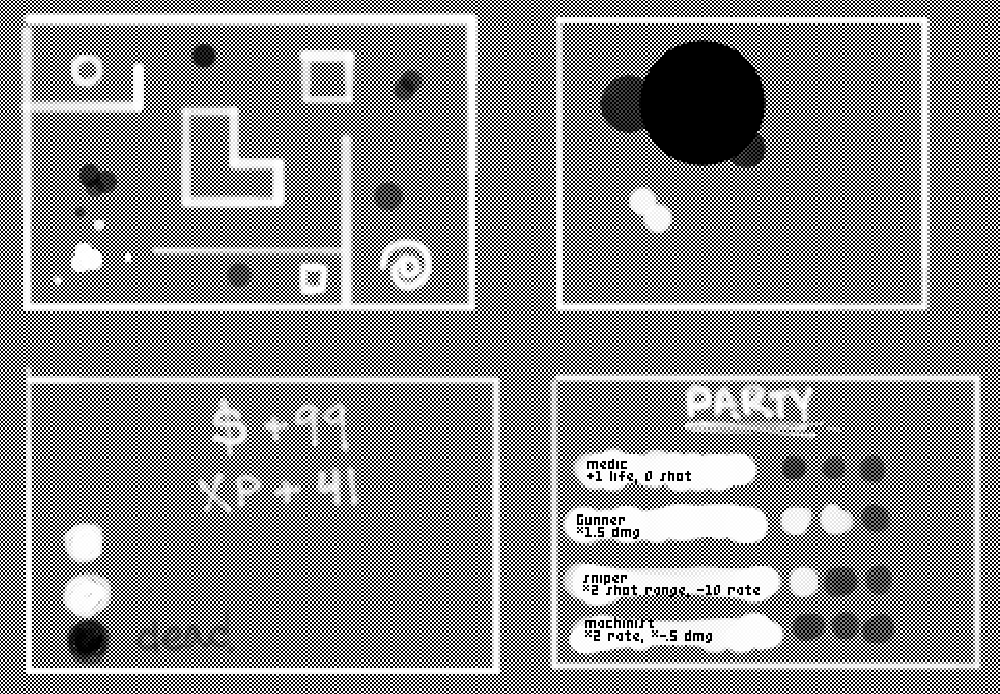
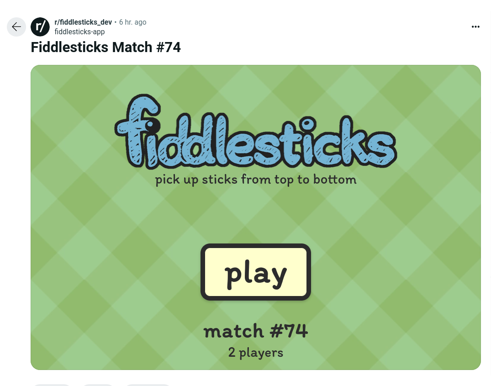
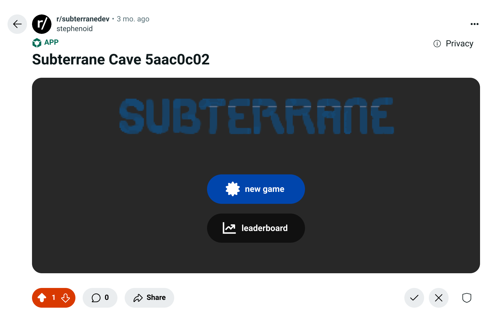
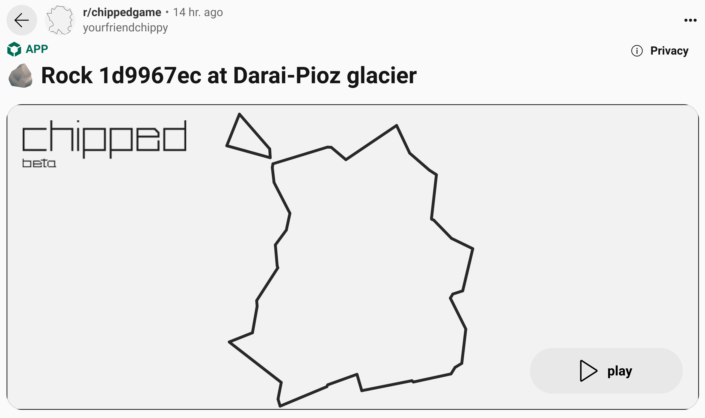
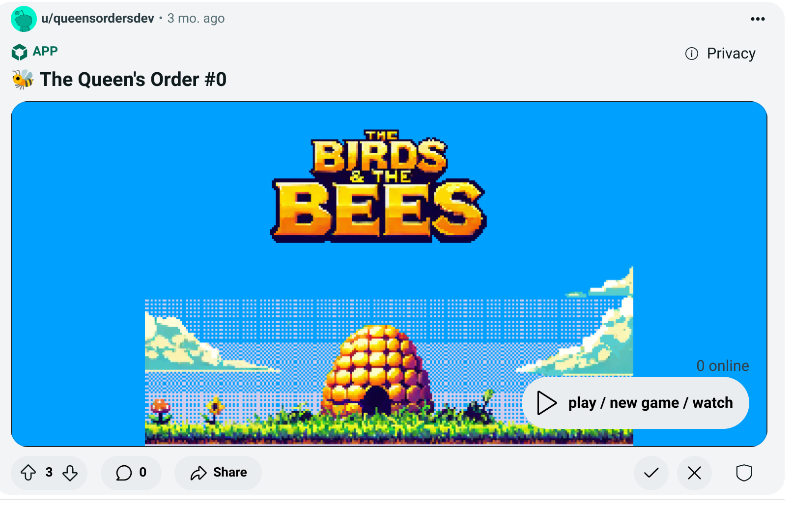

the last six months have been dreamy, hard, and rare. in October 2024, Reddit created a new game development team, Devvit Studios, which I left the Core platform team to join. I made eight "games" (the content of each was closer to demo-sized) from scratch over the last six months. six were solo efforts. they were all open-sourced and I learned a lot.

## [snoosings](https://github.com/reddit/devvit-snoosings)

snoosings is a networked drum machine with a twist: if the internet drops, the last sent melodies will loop, but otherwise you have to keep playing the tones you want friends to hear, and the farther away you are from snoos, the quieter they sound. it's the biggest singing-player game ever.

<video controls width=640 src=snoosings.mov></video>

I built snoosings in ~110 hours from October 16th to 26th in a Ludum Dare-like blitz. I think it was the most challenging game with the exception of Field. the hardest parts were the music (I have no comprehension at all), multiplayer, and just learning to build an iframe app on the new Devvit platform.

I did a good job staying focused on the goal and not getting hung up on anything. snoosings started as an uninspired "redditvszombies" but due to the slowness of realtime, pivoted to a singing game with the idea that if you sang near someone, they'd be converted (like getting bit by a zombie).

it was neat to see some 30 or so people all making these terrible noises together on demo day. no fun at all beyond that but I think the team has developed a bit of a soft spot for it. I'm proud of the work accomplished within the constraints, about 1800 lines of TypeScript.

[additional learnings in the old readme](https://github.com/reddit/devvit-snoosings/commit/daad9353a7d04edf181f0ea535133954181a496d).

## [corridor](https://github.com/reddit/devvit-corridor)

corridor is a top-down shooter.

<video controls width=640 src=corridor.mp4></video>

I built corridor in about four days from October 28th to November 1st. there's no depth but I was quite surprised how fast everything came together given the intensity of snoosings. it's the best looking game I made.

I ended up only being able to implement a single enemy and a single item on a single level before the deadline. I was thinking it would be an amalgamation of the following games:

- [Mercenary Force](https://www.giantbomb.com/mercenary-force/3030-28408)
- [Cave Noire](http://www.hardcoregaming101.net/cave-noire)
- [Teleglitch](https://www.paradoxinteractive.com/games/teleglitch-die-more-edition)
- [Ninja Taro](https://kayin.moe/ninja-taro)
- [Diablo II](https://en.wikipedia.org/wiki/Diablo_II)
- [Vampire Survivors](https://poncle.itch.io/vampire-survivors)
- [River City Ransom](http://www.seanbaby.com/nes/nes/rcr.htm)

there's so many good ideas packed into the above partial list that numerous novel fun mixes exist. I see a lot of potential for corridor to grow into something meaningful given time.

I liked the way I planned it too!

> single-player roguelite with live streaming and replays. only pointer input. only synth sounds. simplified graphics.
> 
> outer loop:
> 1. start a new game spawns a post on the subreddit for live streaming, replay, and for other players to start a new game.
> 2. choose a party of three.
> 3. play three levels.
> 4. fight the boss.
> 5. win: keep points and XP for next playthrough (starting on step 2).
> 6. lose: no gains, points zeroed, XP penalty for next playthrough (starting on step 1).
> 
> non-boss level loop:
> 1. traverse level searching for XP, HP, monsters, and exit. point to move.
> 2. engage monster.
> 3. player and monster auto-shoot one bullet per party member.
> 4. repeat 1-3 until exit is found.
> 
> the boss level is a battle with one big enemy. based on how well you've assembled your party and kept their health, battle is easier or harder. may make this part multiplayer.
> 
> assets:
> - background is a pixel checkerboard.
> - players and enemies are circle groups with variable opacity.
> - bullets are smaller circles.
> - items: XP is a square, health is a circle.
> - levels are dynamic.
> - light means harmless, dark means harmful.
> - exit is a spiral.
> - audio is synth boops.
> - minimalist everything.

the original mock for the above: top-left panel shows non-boss level, top-right is boss, bottom-left is end level screen, bottom right is party select.

[additional learnings in the old readme](https://github.com/reddit/devvit-corridor/commit/6d6e5a448d5926aaf11a4bcd9b3b87277467840c).

## [fiddlesticks](https://github.com/reddit/devvit-fiddlesticks)

fiddlesticks is a competitive game of pick-up sticks.

I built fiddlesticks in about five days from November 3rd to 8th. why did I ever make this? I was encouraged to pick something simple but it was never promising from conception to completion.

probably the worse technical mess of any of the games but I was glad to try out [yhtml](https://github.com/dchester/yhtml) and [lit-html](https://lit.dev/docs/libraries/standalone-templates). I upgraded to full on Lit for Field which was very helpful.

[additional learnings in the old readme](https://github.com/reddit/devvit-fiddlesticks/commit/bfcd9dcbac5b1fdab00a693830c4e4cce4d542f3).

## [subterrane](https://github.com/reddit/devvit-subterrane)

roll dice in the dungeon.

I worked on subterrane from November 12th to 18th (?) but just ran out of time to do anything meaningful with the content.

the dice came out pretty nice. I think there was a lot of potential in making that a "fun movement" especially if there were multiple. it worked pretty well for mobile input too.

## [chipped](https://github.com/reddit/devvit-chipped)

chipped is a rock smashing and collecting game. kind of a kinetic puzzler.

I made chipped from Nov 19 - December 18 (?). the concept was based on an idea I had years ago for a _3D_ rock breaking game:

1. tap rock edges to look for a mineral.
2. keep tapping to break off a chip. if the chip is the smallest of any it touches, it's collected. if not, the cluster is lost.

it was the closest thing to a puzzle game I could think of at the time. I was skeptical a 2D version would be fun but didn't have time for 3D. overall, I was pleased with the mechanics of the concept. you just keep chipping away at a stone and facets break off. make strategic sacrifices to maximize the chance at a mineral. I'm more of an action gamer so having a fun movement was really important to me. I think it was my most successful design.

I think art should either be realistic or fantastic. I decided to use real minerals so the game could be educational in some small way. I wanted to source all the data from [Mindat](https://mindat.org) but it has a noncommerical license so I used Wikidata instead. I wanted as much variation as possible but, for ~5000 minerals the data ended up being rather large, 
Wikidata only has names, symbols, and locations for most minerals. each item in Wikidata has a "Q code" that I think would be awesome to make into a collectible "qard" but I ran out of time to do this well and it was confusing to have both a International Mineralogical Association code (IMA symbol) and a Q code. I'd love to have made them shareable with a QR code too.

I did all my sound recording in a clothes closet just tapping stones with a hammer and it came out fine. for previous games, I recorded in my basement but there was a noticeable echo.

chipped had it's moment in the sun Friday, December 13th right as I was admitted to the emergency room covered in red pin pricks, bruising, and a raw mouth. after 15 years, my blood disease, ITP, had come out of remission due to overwork. my partner fetched my laptop and I pushed a final performance optimization from my hospital bed at the peak of its popularity right as the Devvit platform was straining under the Reddit API load and I awaited an immunoglobulin infusion. I was released the following afternoon but it took six weeks to start feeling like myself again.

## [The Birds & The Bees](https://github.com/reddit/devvit-the-bees)

a fresh multiplayer "tap 'em up" take on 1942.

I collaborated on TBTB January 17th to 24th (?) with a UI designer. we barely completed a demo and I was really disappointed with how everything turned out.

TBTB started as squished! 99 and was selected from some other ideas I had: bugsumo (fight and assemble cyborg bugs with thumb wrestling mechanics), solitaire B (Tetris alternate mode for solitaire), and Paint T.V. (watch artists draw and bid on their work). I think the squished! 99 concept was a winner but the execution was a failure.

<video controls width=640 src=squished-99.mkv></video>

<video controls width=640 src=bugsumo.mkv></video>

<video controls width=640 src=solitaire-b.mkv></video>

by this time, I was spending 15 minutes each morning dedicated just to thinking about fun game designs. in hindsight, I'm happy with the ideas I pitched. I read a little bit of [shmuplations](https://shmuplations.com) most days and sometimes an interview would really resonate into one of these morning sessions. when I had a promising idea space, I'd often a spend a long time brainstorming with my partner. I remember doing that a lot with S99-related concepts on a walk. I'm really curious where this sort of practice could go if I keep it up and I'm hoping to pick it back up one day.

I tried Phaser 3 for the first time. I used [v2 years ago](content/log/2021-01-24) and was quite disappointed but have been a newsletter subscriber since and it sounded like a ton of progress had been made in v3. I was really surprised to find v3 felt exactly the same as v2:
- the built in Aseprite importer is cool but...
  - no support for detecting loops.
  - no support for generating an atlas of sprites unless you do a ton of preprocessing (which I wrote and that worked fine).
  - I don't want to ship the entire JSON file when I only need a part.
  - no support for tilesets.
  - no support for slices.
-  rising edge input detection requires setting a listener; it's not a plain conditional. this really blew my mind. I don't want to manage a callback to test the rising edge of a button. I was really expecting a poller wrapper as part of the API that I could test in my render loop.
- the typing is pretty bad. I know it must feel amazing to the plain JavaScript version that came before but the API really felt something from over 10 years ago. for example, if I want to add physics to a sprite, the way the typing works I have to override the body to assert that it will be nonnullish and static or dynamic. there's got to be a better way to compose this. another example is how some lifecycles have base abstract methods and others are just documentation. it made it hard to rely on my IDE. update() requires registration to run preUpdate() doesn't?
- the docs on the types were pretty good! almost everything has _some_ documentation.
- massive boot config with many redundant options. I really hated this. it was so unintuitive. it made it hard to know how different options interacted and different options had differerent stange bugs. if memory serves, I had a ton of issues getting a resizing to work as wanted in Phaser 2 (it's what actually drove me away) and that didn't change much in Phaser 3. one config gave me a WebGL error (maybe something involving `width: '100%', height: '100%', min: {width: 512, height: 512}`).
- the editor kind of blows away a lot of the custom code I would write. I was hoping for something a bit more polished.
- Phaser operates as a global and typing infests everything.
- complex class hierarchies.
- hard to understand the division of types when dotting off of the Phaser wrapper. it wasn't intuitive to find the class to subclass using autocompletion, for example.
- enormous number of examples but as helpful as unhelpful; outdated, very loose JavaScript, feels more like "maybe this works" than "this is _the_ way to do x."
- loading APIs aren't async. you either have to use callbacks or split up loading across multiple scenes.
- all (?) Phasers objects are tightly coupled; no simple data. everyone has access to everything.
- built in animation and physics. that's pretty neat!
- too many APIs in too many places. Phaser.Math.FloatBetween(0.5, 1) Phaser.Math.RND, Phaser.Math.RandomNumberGeneratorThing, integerInRange / between() are the same function with two names.
- the official tutorial gives an approach for tiling that easily causes an OOM https://www.thepolyglotdeveloper.com/2020/08/continuous-side-scrolling-phaser-game-tile-sprites/.

the multiplayer aspect was challenging. I think I ended up having a static level seed. enemies were seeded and came in waves based on your position. you transmitted your location and whatever enemies you smashed so they also got smashed across all other players.

I think the game concept was solid and has a lot of potential as a genre. I really wished we would have gone with the original robotic theme instead of gory "murder hornets". I thought something mechanical would be fun to tear apart, especially on mobile devices where a finger is the cursor.

## [Paint T.V.](https://github.com/reddit/devvit-paint-tv)

Paint T.V. is a paint app with live viewing and comment-based bidding mechanics.

<video controls width=640 src=paint-tv.mkv></video>

I barely started Paint T.V. while we were trying to decide whether or not to pursue Field. it was really becoming the culmination of everything I had learned so far.

## [Field](https://github.com/reddit/devvit-field)

Field (originally, BanField; alias A1) was Reddit's 2025 April Fools' Day prank. it was kind of a cross between Minesweeper and MS Paint, and more of an experience than a game.

Field was developed from January 31st to April 3rd. it was Studios' largest collaboration by far. from April 1st to 3rd, the game was played by two million with 290 thousand players earning a point (completing all levels) and I personally saw in excess of 10 thousand players online. I worked on it day and night for nearly two months straight.

it was something of a bathroom stall simulator. I was so focused on just finishing the technical work that I didn't consider just how much hatred would be expressed during the event. I hope it was in jest.

## learnings

- deliberate design. don't just say "I like action RPGs" and expect something novel to work out. be intentionally fun.
- make fun parts as fast as possible. try not to work on anything else.
- pick games that are easy for me to make. don't attempt anything impossible.
- be tactical about art and sound.
- spend the most time thinking about what players want. players don't care about code.
- get the art sizes right as soon as possible for desktop and mobile.
- make games with fun movements.
- you don't get what you don't aim at. think critically when planning. don't build something I know I don't want.
- less is more. complexity is hard to do well and, as an indie dev, I'm probably better off striving to do simple yet deep.
- don't compete with the player's imagination.
- pick art styles that are fast and fun. probably pixelated but not necessarily hard pixels. favor satisfying textures and consider variation.
- make a one page mock. I think this really helped me understand the general direction and not get lost.
- design for copy and paste but keep a library. upstream to the library after each project.
- regroup regularly.
- be practical.
- plan simply. don't plan far beyond fun.
- think more on doing less.
- have fun.
- front loaded routines are a powerful tool to guarantee space for something in your life. they make make long term progress possible even when time is scarce. if it's not part of my day or at least my week, it's out of my life.
- objective observations by [those involved but not invested](https://en.wikipedia.org/wiki/The_Chicken_and_the_Pig#Content) can be valuable or destructive.
- building small games is good practice.
- sleep is required.
- impossible and hard feel the same. I can't tell when I'm just going through a rough patch so I better not give up.
- Lit elements (custom elements) are kind of like any game framework or a popular Photoshop brush. they're a huge boost to development speed at the expense of the default unique experience you get with a homegrown implementation. I think it'd be hard to make it feel substantially different so I will probably avoid it in future work. however, the DOM really fit our UI designer's expectations for everything they mocked out.
- finally got to [a plain Node.js test runner](https://github.com/niedzielski/node-ts-template) which I kept striving towards but could never quite find the right TypeScript configuration. really love the type-stripped scripts and Field's TypeScript syntax was fully erasable.
- abandon bad ideas as soon as identified.

it was fun dealing with the design constraints of a new platform. a good designer will embrace the constraints and I tried but wow was it hard. for the time I worked on it, Reddit wasn't able to make big changes in how games were distributed. games were published as posts without distinction on web, native Android, and native iOS. this is the last checklist I had put together:
  - unique state and initial screen per post with a strong call to action.
  - simple yet deep gameplay with a fun core loop; fun movement or puzzle and progression.
  - responsive design and pointer input that works well on mobile devices.
  - catchy simple art style with room for the imagination.
  - satisfying sound effects.
  - encourages new posts, upvotes, share as comment, subscribe to sub, and subscribe to notifications. the more social games can be the better. comments drive the algo like crazy.
  - per post and global leaderboards.
  - posts can be made by users or scheduler.
  - snoovatar integration.
  - art, code, and sound are small enough to build with time and resources available.
  - user generated content is great for social sites like Reddit and also a great way to minimize content costs.

I also wrote a little guide, [Reddit for Game Makers](20241219%20Reddit%20for%20Game%20Makers.pdf), that was distributed over Discord to community devs. the platform is changing so fast that it's already outdated.

## what's next

I really want to make fun games. it's very hard. building a demo is possible each week but not production quality games with persistence, seedability, multiplayer, and scalability across three platforms.

game design was a lot of fun and I wonder what I can do. I want to reincorporate 15 minutes of game design into my daily routine. I spent all my time in college on programming and hardware design and never had time for more creative pursuits that I think are a more natural fit for me.

it's been neat to work so much at the heart of the platform and know so much of its tangled history up and down. it really helped me debug platform issues when they arose.

most of the games have already broken down as the platform has evolved beyond them. nevertheless, I'm proud of my work.

Studios was slated for disbandment right before the launch of Field. I'm back into platform work on the new Creation team like I never left working on a major rewrite.

I don't know where I go from here but I feel excited and ready.

<iframe
  width=560
  height=315
  src=https://www.youtube.com/embed/OT5pdFtC5ls
  title="All That's Left Is to Say Goodbye"
  frameborder=0
  allowfullscreen
></iframe>
